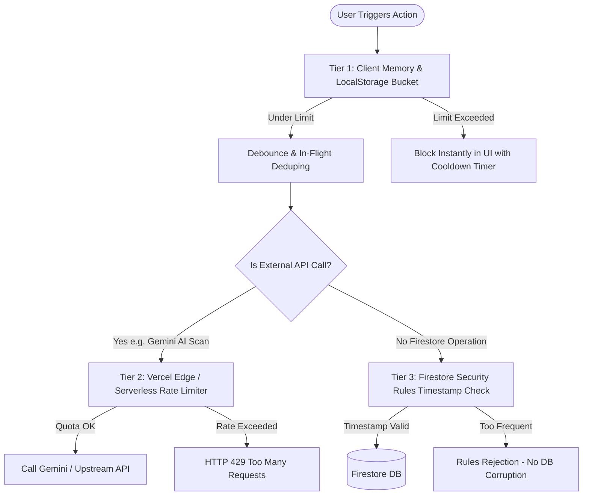
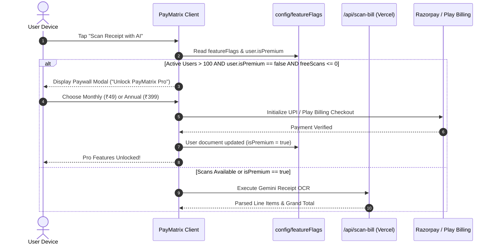
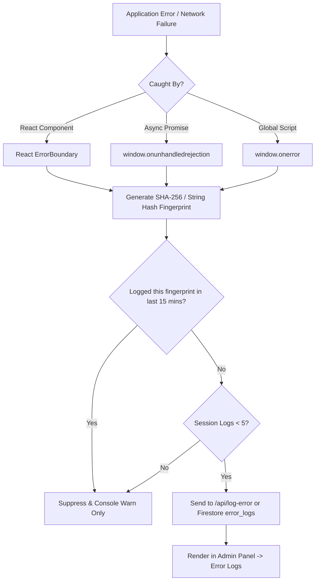
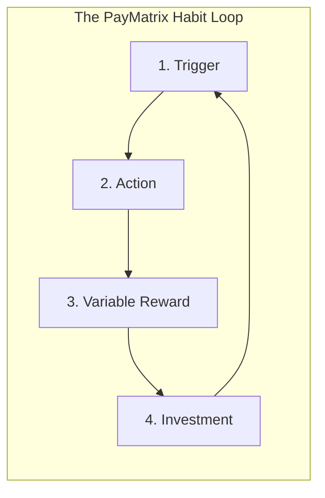

# PayMatrix — Firebase Free-Tier Scaling, Quota Protection, & Growth Master Plan

> **Document Status:** Operational Blueprint & Architecture Reference  
> **Target Audience:** Engineering, Product, Growth & Operations  
> **Scope:** Firebase Free (Spark Plan) limits, Zero-Cost Rate Limiting, Active Users >100 Paywall Trigger, Zero-Quota Analytics & Error Telemetry, Database Backup & Migration Playbook, and Habit-Forming Product Psychology.

---

## 1. Executive Summary & Current Baseline

### Current State
- **Registered User Base:** 36 total users (non-active / initial testing cohort).
- **Hosting / Compute Infrastructure:**
  - Frontend: React 19 PWA hosted on Vercel (`pay-matrix.vercel.app`).
  - Android App: Native Kotlin wrapper / TWA ready for Google Play release.
  - Serverless AI Proxy: Vercel Serverless Function (`frontend/api/scan-bill.js`) running `gemini-3.1-flash-lite`.
  - Database & Backend: Firebase Cloud Firestore, Firebase Auth, Firebase Cloud Messaging (FCM), Firebase Cloud Functions.
- **Current Plan:** Firebase **Spark Plan (100% Free)**.

### The Spark Quota Dilemma
On the Spark plan, Firebase **hard-stops** services when daily quotas are reached rather than charging for overage. A single unoptimized real-time listener or repeated queries across large group ledgers can consume the 50,000 document reads in minutes, resulting in `RESOURCE_EXHAUSTED` errors that lock all 36+ users out until the daily midnight Pacific Time quota reset.

This master plan provides an ironclad engineering architecture to:
1. Safely scale to **100+ daily active users** within the free Spark limits.
2. Automatically trigger a **premium paywall** on resource-heavy features (like Gemini AI bill scanning) once active users cross 100.
3. Track rich user analytics and capture 100% of application errors inside the Admin Panel without burning Firestore read/write quota.
4. Execute an immediate, zero-data-loss database download and migration to Postgres/Supabase if growth demands an exit from Firebase.
5. Deploy habit-forming psychological loops to turn casual bill-splitters into daily active advocates.

---

## 2. Firebase Spark (Free Tier) Limit Research & Capacity Modeling

### 2.1 Official Firebase Spark Quotas (Updated 2026)

| Service | Spark (Free) Quota | Reset Cadence | Failure Mode on Exceeded |
| :--- | :--- | :--- | :--- |
| **Firestore Document Reads** | **50,000 / day** | Daily (Midnight US PT / 12:30 PM IST) | Read requests fail with `RESOURCE_EXHAUSTED` |
| **Firestore Document Writes** | **20,000 / day** | Daily | Write requests fail with `RESOURCE_EXHAUSTED` |
| **Firestore Document Deletes** | **20,000 / day** | Daily | Delete calls fail |
| **Firestore Stored Data** | **1 GiB total** | Permanent aggregate | New writes rejected once DB exceeds 1 GiB |
| **Firestore Realtime Listeners** | **100 concurrent** | Real-time concurrent connections | Connection refused for 101st listener |
| **Firestore Network Egress** | **10 GiB / month** | Monthly | Traffic throttled / rejected |
| **Firestore Write Contention** | **1 write/sec per document** | Continuous | Write transaction fails / aborts |
| **Cloud Functions Invocations** | **0 / month on Spark** (Gen 2 requires Blaze; Gen 1 Google-only) | N/A | Cloud Functions cannot access external internet |
| **Firebase Auth (Identity)** | **50,000 MAU** | Monthly | New registrations blocked |
| **Firebase Cloud Messaging** | **Unlimited** (100% Free) | N/A | Never blocked |
| **Cloud Storage** | **5 GB total**, 1 GB/day download | Daily / Aggregate | Media uploads/downloads fail |

> [!IMPORTANT]
> **Cloud Functions Outbound Networking Trap:**
> On the free Spark plan, Cloud Functions cannot call external APIs (like Gemini, OpenAI, Stripe, or custom webhooks). PayMatrix already cleverly routes Gemini OCR requests through **Vercel Serverless Functions** (`frontend/api/scan-bill.js`). Vercel's free Hobby plan provides **100,000 invocations/month** and unrestricted outbound internet. Keep all third-party API integrations on Vercel to preserve the 100% free model.

---

### 2.2 Mathematical Consumption Model: From 36 to 500 Users

Let us calculate Firestore read/write math across realistic user sessions.

#### Unoptimized Ledger Problem:
If an active group has 60 expenses and 15 settlements, opening the Group Detail page requires `60 + 15 + 1 (group) = 76 document reads`.
If Home Dashboard queries all expenses across 3 active groups to calculate balances, opening the app costs `3 × 75 = 225 document reads`.

| User Cohort | App Opens / User / Day | Actions / Day (Add Expense/Settle) | Daily Reads (Unoptimized) | Daily Reads (Optimized with Cache & Materialized Summaries) | Daily Writes | Spark Status |
| :--- | :--- | :--- | :--- | :--- | :--- | :--- |
| **36 Total (Current)** | 2 | 0.5 | ~5,400 | **~540** | **~75** | **Ultra Safe** (1% of quota) |
| **100 Active Users** | 3 | 1.5 | ~67,500 ⚠️ | **~4,800** | **~450** | **Safe** (9.6% of quota) |
| **300 Active Users** | 4 | 2.0 | ~270,000 ❌ | **~18,000** | **~1,800** | **Safe** (36% of quota) |
| **500 Active Users** | 4 | 2.5 | ~500,000 ❌ | **~35,000** | **~3,750** | **Near Ceiling** (70% quota) |
| **1,000 Active Users** | 5 | 3.0 | ~1,200,000 ❌ | **~85,000** ❌ | **~9,000** | **Quota Exceeded** (Must Migrate) |

**Conclusion:** Without client caching and rate limiting, **75 active users** will exhaust the free tier. With the zero-cost architecture outlined below, **up to 400–500 active users can run 100% free on Firebase Spark**.

---

## 3. Zero-Cost Rate Limiting & Quota Protection Architecture

### 3.1 The Flaw in Current Firestore-Based Rate Limiting
Currently, `rateLimitService.js` attempts to protect endpoints by running a Firestore transaction on `rate_limits/{userId}`:
```javascript
// ANTIPATTERN FOR FREE TIER:
await runTransaction(db, async (transaction) => {
  const limitDoc = await transaction.get(limitDocRef); // 1 READ
  // ...
  transaction.set(limitDocRef, ...);                   // 1 WRITE
});
```
Every time a user performs an action, the app spends **1 Read + 1 Write** just to verify the rate limit. If 100 users perform 15 actions a day, **3,000 reads and 3,000 writes (15% of total write quota)** are wasted solely on rate-limiting overhead!

Furthermore, line 606 of `firestore.rules` restricts `/rate_limits/{userId}` to the specific fields used by `scan-bill.js` (`['uid', 'count', 'windowStart', 'lastRequestAt']`), causing general actions in `rateLimitService.js` to trigger permission-denied errors.

### 3.2 The 3-Tier Zero-Quota Rate Limiting Solution



#### Tier 1: Client-Side Token Bucket (Zero Network, Zero Firestore Reads/Writes)
Implement rate limiting in client memory backed by `localStorage`:
```javascript
// Architecture: clientRateLimiter.js
class ClientRateLimiter {
  static check(actionKey, maxAttempts = 5, windowMs = 60000) {
    const storageKey = `pm_rl_${actionKey}`;
    const now = Date.now();
    let record = JSON.parse(localStorage.getItem(storageKey) || '{"timestamps":[]}');
    
    // Purge timestamps outside sliding window
    record.timestamps = record.timestamps.filter(ts => now - ts < windowMs);
    
    if (record.timestamps.length >= maxAttempts) {
      const oldest = record.timestamps[0];
      const waitSeconds = Math.ceil((windowMs - (now - oldest)) / 1000);
      throw new Error(`Please slow down. Try again in ${waitSeconds}s.`);
    }
    
    record.timestamps.push(now);
    localStorage.setItem(storageKey, JSON.stringify(record));
    return true;
  }
}
```

#### Tier 2: Vercel Edge Serverless Rate Limiter (Protects Gemini API)
For serverless functions like `frontend/api/scan-bill.js`:
- Track user scan attempts using an in-memory sliding window or Vercel Edge KV.
- Hard limit free users to **3 scans / 24 hours** once users scale.
- Protects Gemini API tokens without requiring Firestore transactions.

#### Tier 3: Security Rule Timestamp Constraints (Free Rule Evaluation)
Enforce database-level rate limiting directly in `firestore.rules` without extra documents:
```javascript
// Ensure expenses cannot be created faster than once every 3 seconds per user
allow create: if isSignedIn() &&
              request.time > resource.data.createdAt + duration.value(3, 's');
```

---

## 4. Premium Feature Gating Plan (Active Users > 100)

### 4.1 Why 100 Active Users is the Exact Inflection Point
1. **Gemini API Limits:** Google's free Gemini API key enforces a strict quota:
   - 15 Requests Per Minute (RPM).
   - 1,500 Requests Per Day (RPD).
   - 1,000,000 Tokens Per Minute (TPM).
   When total active users exceed 100, weekend dining rushes (8:00 PM – 11:00 PM IST) will produce concurrent receipt scans exceeding 15 RPM, triggering HTTP 429 failures.
2. **Firestore Free Quota:** 100 daily active users with receipt parsing and multi-user split notifications approach 20,000 writes/day.
3. **Monetization Viability:** In consumer fintech, a 3–5% conversion rate on 100+ highly engaged active users proves willingness to pay before incurring infrastructure bills.

---

### 4.2 Feature Matrix: Free vs. PayMatrix Pro

| Feature | Free Tier (All Users) | PayMatrix Pro (₹49/month or ₹399/year) |
| :--- | :--- | :--- |
| **Group Expense Splitting** | Unlimited (Equal, Percentage, Paise) | Unlimited |
| **Friend Settlements** | Unlimited min-flow calculations | Unlimited min-flow calculations |
| **UPI QR Generation** | Unlimited GPay / PhonePe / Paytm | Unlimited |
| **Offline Synchronization** | Full local cache & queued writes | Full local cache & queued writes |
| **AI Receipt Scanning** | **3 scans per month** (Trial) | **Unlimited Gemini AI Receipt Scanning** |
| **Multi-Receipt Stitching** | Disabled (Single receipt only) | Enabled (Stitch up to 4 receipts) |
| **Export Reports** | Basic CSV export | **Custom PDF & Excel Reports with Receipts** |
| **Expense Categories** | Standard 9 categories | Unlimited custom categories & tags |
| **UI Aesthetics** | Digital Obsidian Standard | **Obsidian Gold VIP Theme & Pro Badge** |

---

### 4.3 Automated Paywall Activation Flow



### 4.4 Technical Implementation Architecture
1. **Active User Tracking Document:** A lightweight document `config/metrics` updated by a nightly Vercel cron or admin trigger calculating 30-day active users.
2. **Dynamic Feature Flag:** In Firestore `config/featureFlags`:
   ```json
   {
     "billScanning": true,
     "aiScanRequiresPremium": true,
     "freeScanAllowancePerMonth": 3,
     "activeUserCountThreshold": 100
   }
   ```
3. **User Document Schema Extension:**
   ```json
   {
     "isPremium": true,
     "premiumTier": "annual",
     "premiumExpiresAt": "2027-09-03T21:00:00.000Z",
     "monthlyScanUsage": {
       "period": "2026-09",
       "count": 2
     }
   }
   ```

---

## 5. Zero-Cost Universal Analytics Architecture

### 5.1 The Quota Trap in Database Analytics
Many startups attempt to log analytics events (e.g. `page_view`, `button_click`, `view_group`) directly into a Firestore collection (`analytics_events`).  
**The Math:** 100 users × 35 events per session = **3,500 Firestore writes per day**. That single decision burns 18% of your entire database write allowance on telemetry!

### 5.2 The 2-Tier Zero-Quota Solution

```
┌─────────────────────────────────────────────────────────────────┐
│                       PayMatrix Client                          │
└────────────────┬───────────────────────────────┬────────────────┘
                 │                               │
       (Zero Quota Cost)                 (Max 1 Write/Day)
                 ▼                               ▼
  ┌─────────────────────────────┐   ┌─────────────────────────────┐
  │   Google Analytics 4 (GA4)  │   │     User Daily Heartbeat    │
  │   - Realtime Active Users   │   │     - writes to users/{uid} │
  │   - Feature Funnels & Drops │   │     - field: lastActiveDate │
  │   - Retention & Cohorts     │   │     - deduplicated locally  │
  └──────────────┬──────────────┘   └──────────────┬──────────────┘
                 │                                 │
                 └───────────────┬─────────────────┘
                                 ▼
                 ┌───────────────────────────────┐
                 │     PayMatrix Admin Panel     │
                 │   - Realtime DAU / WAU / MAU  │
                 │   - Financial Totals          │
                 │   - Scan Conversion Metrics   │
                 └───────────────────────────────┘
```

#### Tier 1: Google Analytics 4 (GA4) / Firebase Analytics (100% Free, Unlimited Events)
- Wire Google Analytics via `@firebase/analytics` or global gtag.
- Log user flows without touching Firestore:
  - `event('add_expense', { category, split_type, is_settled })`
  - `event('scan_bill_attempt', { user_id, is_premium })`
  - `event('upi_qr_generated', { app_target, amount })`
  - `event('group_created', { member_count })`

#### Tier 2: Daily Heartbeat (Max 1 Firestore Write Per Active User Per Day)
To allow the Admin Panel to display exact active user counts directly from Firestore without scanning all historical data:
```javascript
// utils/heartbeat.js
export const recordUserHeartbeat = async (uid) => {
  const today = new Date().toISOString().slice(0, 10); // "2026-09-03"
  const lastHeartbeat = localStorage.getItem('pm_last_heartbeat');
  
  if (lastHeartbeat === today) return; // Deduplicate: exactly 0 DB writes today!

  try {
    const userRef = doc(db, 'users', uid);
    await updateDoc(userRef, {
      lastActiveDate: today,
      lastActiveAt: serverTimestamp()
    });
    localStorage.setItem('pm_last_heartbeat', today);
  } catch (err) {
    // Non-blocking telemetry failure
  }
};
```
- **Cost:** Exactly 1 write per active user per day. 100 active users = 100 writes/day (0.5% of quota).

---

### 5.3 Admin Panel Analytics Integration
In `AdminAnalytics.jsx`, replace client-side full collection fetches with **Firestore Aggregation Queries (`count()`)**:
- A `count()` query costs **1 read per 1,000 documents**, rather than 1 read per document!
- Query Daily Active Users:
  ```javascript
  const today = new Date().toISOString().slice(0, 10);
  const dauSnap = await getCountFromServer(
    query(collection(db, 'users'), where('lastActiveDate', '==', today))
  );
  const dailyActiveUsers = dauSnap.data().count; // Costs only 1 document read!
  ```

---

## 6. Error Resilience, Telemetry & Admin Panel Logging

### 6.1 The Risk: Logging Infinite Loops
If an uncaught render loop or network disconnect triggers an error on every frame (60 fps), and each error immediately calls `db.collection('errors').add()`, the client will generate **3,600 writes per minute**, exhausting your Firebase daily limit in under 6 minutes.

### 6.2 The Resilient Error Logging Pipeline



#### Client-Side Throttled Error Logger
```javascript
// services/resilientLogger.js
const errorCache = new Set();

export const logClientError = async (error, context = {}) => {
  const errorMsg = error?.message || String(error);
  const stackSnippet = (error?.stack || '').split('\n').slice(0, 2).join(' ');
  const fingerprint = `${context.service || 'app'}:${errorMsg}:${stackSnippet}`;
  
  // Throttle: Never report the same error signature twice within 15 minutes
  if (errorCache.has(fingerprint)) return;
  errorCache.add(fingerprint);
  setTimeout(() => errorCache.delete(fingerprint), 15 * 60 * 1000);

  const payload = {
    message: errorMsg.slice(0, 300),
    stack: (error?.stack || '').slice(0, 1000),
    context,
    url: window.location.pathname,
    userAgent: navigator.userAgent.slice(0, 150),
    timestamp: new Date().toISOString(),
    uid: auth.currentUser?.uid || 'anonymous'
  };

  try {
    // Route through serverless function or rate-limited collection
    await fetch('/api/log-error', {
      method: 'POST',
      headers: { 'Content-Type': 'application/json' },
      body: JSON.stringify(payload),
      keepalive: true // Ensure logs deliver even if page unloads
    });
  } catch {
    console.error('[ErrorLogger Failed Fallback]', payload);
  }
};
```

#### Admin Panel View
Add an **"App Errors"** tab to `AdminDashboard.jsx` that queries the `error_logs` collection ordered by `timestamp desc` with:
- Error Frequency & Affected User Count.
- Stack trace modal with copy button.
- Device & OS distribution (identifying Android WebView vs. Chrome bugs).
- "Resolve" button that archives recurring errors.

---

## 7. Database Backup, Download & Migration Playbook

When active users approach **400–500** or monthly reads consistently cross **35,000/day (70% threshold)**, initiate migration off Firebase Spark to an open-source relational database.

### 7.1 Target Architecture: Supabase (PostgreSQL with Row Level Security)
- **Why Supabase?**
  - **Free Tier:** 500 MB database storage, 50,000 Monthly Active Users, unlimited API reads/writes, 5 GB bandwidth.
  - **Row Level Security (RLS):** Direct 1-to-1 equivalent of `firestore.rules`.
  - **Relational Integrity:** Foreign keys prevent orphaned expenses when groups are deleted.
  - **Exact Paise Math:** Native `BIGINT` support for financial calculations eliminates floating point rounding errors.

---

### 7.2 Automated Database Export Script (`scripts/export-database.js`)
Use this standalone Node.js script to export all PayMatrix Firestore collections and subcollections into clean JSON/NDJSON:

```javascript
/**
 * scripts/export-database.js
 * Usage: node scripts/export-database.js --serviceAccount=./serviceAccountKey.json
 */
const fs = require('fs');
const path = require('path');
const admin = require('firebase-admin');

const serviceAccountPath = process.argv.find(arg => arg.startsWith('--serviceAccount='))?.split('=')[1]
  || './serviceAccountKey.json';

if (!fs.existsSync(serviceAccountPath)) {
  console.error(`Error: Service account file not found at ${serviceAccountPath}`);
  process.exit(1);
}

const serviceAccount = require(path.resolve(serviceAccountPath));
admin.initializeApp({ credential: admin.credential.cert(serviceAccount) });
const db = admin.firestore();

const EXPORT_DIR = path.join(__dirname, `../backups/export-${new Date().toISOString().replace(/[:.]/g, '-')}`);
fs.mkdirSync(EXPORT_DIR, { recursive: true });

async function exportCollection(colName, subCollections = []) {
  console.log(`Exporting collection: ${colName}...`);
  const snapshot = await db.collection(colName).get();
  const records = [];

  for (const doc of snapshot.docs) {
    const data = { _id: doc.id, ...doc.data() };

    // Export nested subcollections if specified
    for (const subCol of subCollections) {
      const subSnap = await doc.ref.collection(subCol).get();
      data[subCol] = subSnap.docs.map(s => ({ _id: s.id, ...s.data() }));
    }

    records.push(data);
  }

  const filePath = path.join(EXPORT_DIR, `${colName}.json`);
  fs.writeFileSync(filePath, JSON.stringify(records, null, 2));
  console.log(`Saved ${records.length} records to ${filePath}`);
}

async function runExport() {
  try {
    await exportCollection('users');
    await exportCollection('publicProfiles');
    await exportCollection('groups', ['expenses', 'settlements', 'activity']);
    await exportCollection('logGroups', ['entries', 'activity']);
    await exportCollection('friendRequests');
    await exportCollection('groupInvites');
    await exportCollection('notifications');
    await exportCollection('config');

    console.log(`\nEXPORT COMPLETE! All files stored in:\n${EXPORT_DIR}`);
  } catch (err) {
    console.error('Export failed:', err);
  }
}

runExport();
```

---

### 7.3 PostgreSQL / Supabase Schema (DDL)

```sql
-- 1. Users & Public Profiles
CREATE TABLE users (
    id UUID PRIMARY KEY DEFAULT gen_random_uuid(),
    firebase_uid VARCHAR(128) UNIQUE NOT NULL,
    email VARCHAR(255) UNIQUE,
    display_name VARCHAR(100),
    avatar_url TEXT,
    upi_id VARCHAR(100),
    is_premium BOOLEAN DEFAULT FALSE,
    premium_expires_at TIMESTAMPTZ,
    created_at TIMESTAMPTZ DEFAULT NOW(),
    updated_at TIMESTAMPTZ DEFAULT NOW()
);

-- 2. Groups
CREATE TABLE groups (
    id UUID PRIMARY KEY DEFAULT gen_random_uuid(),
    name VARCHAR(150) NOT NULL,
    category VARCHAR(50) DEFAULT 'General',
    created_by UUID REFERENCES users(id) ON DELETE CASCADE,
    invite_code VARCHAR(12) UNIQUE,
    status VARCHAR(20) DEFAULT 'active', -- active, archived, deleted
    created_at TIMESTAMPTZ DEFAULT NOW(),
    updated_at TIMESTAMPTZ DEFAULT NOW()
);

-- 3. Group Members (Many-to-Many)
CREATE TABLE group_members (
    group_id UUID REFERENCES groups(id) ON DELETE CASCADE,
    user_id UUID REFERENCES users(id) ON DELETE CASCADE,
    role VARCHAR(20) DEFAULT 'member', -- admin, member
    joined_at TIMESTAMPTZ DEFAULT NOW(),
    PRIMARY KEY (group_id, user_id)
);

-- 4. Expenses
CREATE TABLE expenses (
    id UUID PRIMARY KEY DEFAULT gen_random_uuid(),
    group_id UUID REFERENCES groups(id) ON DELETE CASCADE,
    paid_by UUID REFERENCES users(id) ON DELETE RESTRICT,
    title VARCHAR(200) NOT NULL,
    amount_paise BIGINT NOT NULL CHECK (amount_paise > 0),
    category VARCHAR(50) DEFAULT 'Other',
    split_type VARCHAR(20) DEFAULT 'equal', -- equal, exact, percentage
    receipt_url TEXT,
    notes TEXT,
    date TIMESTAMPTZ NOT NULL,
    created_at TIMESTAMPTZ DEFAULT NOW(),
    updated_at TIMESTAMPTZ DEFAULT NOW()
);

-- 5. Expense Splits (Who owes what)
CREATE TABLE expense_splits (
    id UUID PRIMARY KEY DEFAULT gen_random_uuid(),
    expense_id UUID REFERENCES expenses(id) ON DELETE CASCADE,
    user_id UUID REFERENCES users(id) ON DELETE RESTRICT,
    owed_paise BIGINT NOT NULL,
    percentage NUMERIC(5, 2),
    PRIMARY KEY (expense_id, user_id)
);

-- 6. Settlements (Debt clearance)
CREATE TABLE settlements (
    id UUID PRIMARY KEY DEFAULT gen_random_uuid(),
    group_id UUID REFERENCES groups(id) ON DELETE CASCADE,
    payer_id UUID REFERENCES users(id) ON DELETE RESTRICT,
    payee_id UUID REFERENCES users(id) ON DELETE RESTRICT,
    amount_paise BIGINT NOT NULL CHECK (amount_paise > 0),
    payment_method VARCHAR(30) DEFAULT 'UPI',
    status VARCHAR(30) DEFAULT 'confirmed', -- pending, confirmed
    confirmed_at TIMESTAMPTZ,
    created_at TIMESTAMPTZ DEFAULT NOW()
);

-- 7. Indexes for Ultra-Fast Queries
CREATE INDEX idx_group_members_user ON group_members(user_id);
CREATE INDEX idx_expenses_group_date ON expenses(group_id, date DESC);
CREATE INDEX idx_settlements_group ON settlements(group_id);
CREATE INDEX idx_expense_splits_user ON expense_splits(user_id);
```

---

## 8. Behavioral Psychology & Habit Formation Mechanics ("The Hook Model")

To scale PayMatrix from 36 users to thousands organically, the product must embed psychological triggers that transform a transactional chore (paying money) into a habit-forming social ritual.



### 8.1 Step 1: Triggers (Awkwardness Relief & Financial Clarity)
- **External Triggers:**
  - *The "Payer's Ping":* Push notification: *"Arjun covered ₹1,850 for Friday Dinner. Your share is ₹462. Tap to inspect & settle."*
  - *The End-of-Weekend Nudge:* Sunday 8:00 PM notification: *"3 unsettled expenses from this weekend. Settle now to start Monday with a clean slate."*
  - *The Payday Trigger:* 1st of the month: *"Salaries are in! Clear your PayMatrix dues in 1 tap with UPI."*
- **Internal Triggers:**
  - The visceral anxiety of forgetting to pay a friend.
  - The awkwardness of having to text someone: *"Hey, do you remember that ₹300 you owe me?"*

---

### 8.2 Step 2: Action (Minimum Viable Effort — The 3-Second Rule)
Friction is the enemy of retention. If adding an expense takes 30 seconds, users revert to WhatsApp text notes.
- **The 3-Second Scan:** Camera open -> Instant Gemini Flash OCR -> Split evenly among group -> Done.
- **Instant UPI QR:** Never ask a friend for their UPI phone number or handle again. One tap displays a high-contrast UPI QR with the exact paise amount pre-filled.

---

### 8.3 Step 3: Variable Rewards (Social Gratification & Dopamine)
- **The "Clean Slate" Euphoria:** When all balances in a group hit ₹0.00, trigger a celebratory micro-interaction (sound effect, dark obsidian neon glow, confetti, and a badge: *"Debt Free! You owe nothing."*).
- **"Debt Karma" & Reliability Rating:**
  - Score users from 0 to 100 based on settlement speed:
    - ⚡ *Lightning Settle (settled < 2 hours)*
    - 🛡️ *Reliable Settle (settled < 24 hours)*
    - 🐢 *The Sloth (takes > 7 days)*
  - Display friendly badges in the group member list. Friends naturally compete to maintain their "Lightning" status.
- **Monthly "PayMatrix Wrapped":**
  - Infographic ready for Instagram Stories:
    - *"Your Squad spent ₹42,800 this month."*
    - *"Top Category: 48% Late Night Swiggy."*
    - *"Most Generous: Rahul (paid 6 times first)."*
    - *"Fastest Settler: Priya (average 12 minutes)."*

---

### 8.4 Step 4: Investment (Switching Cost Moats)
Every time a user enters data, they make it harder to leave PayMatrix:
- **Shared Group Ledger History:** The group's entire Goa trip, flat rent history, and office lunch ledger is preserved forever.
- **Saved UPI VPAs:** The app remembers which friend prefers GPay vs. Paytm.
- **Personal Spending Log:** The user uses PayMatrix not just for groups, but as their personal expense tracker.

---

### 8.5 Growth & Viral Loops (The Inherent K-Factor)
PayMatrix has an organic viral coefficient ($K > 1$) because money cannot be split alone:
1. **The WhatsApp Bill Drop:** When an expense is recorded, generate a one-tap WhatsApp share card:
   > *"🍕 Friday Pizza Night split on PayMatrix:*  
   > *Total: ₹1,400 | Your Share: ₹350*  
   > *View breakdown or pay in 1 click: https://pay-matrix.vercel.app/join/A8K9X2"*
2. **Guest Settlement (Zero Signup Barrier):** Allow a friend to view the bill and pay via UPI QR without even creating an account! Once they pay, prompt: *"Save your receipt and track future splits with 1 tap via Google Sign-In."*

---

## 9. Operational Milestones & Action Checklist

| Phase | User Threshold | Immediate Actions | Quota Risk |
| :--- | :--- | :--- | :--- |
| **Phase 1 (Current)** | 36 Users | 1. Implement client-side `localStorage` token bucket.<br>2. Restrict `scan-bill.js` to 3 free scans/user/day.<br>3. Enable GA4 client telemetry. | **None (Safe)** |
| **Phase 2 (Growth)** | 100 Active Users | 1. Activate Pro Paywall flag (`aiScanRequiresPremium: true`).<br>2. Enable Daily Heartbeat tracking for Admin DAU.<br>3. Monitor Firestore daily reads in Firebase Console. | **Low** (~5,000 reads/day) |
| **Phase 3 (Scale)** | 300 Active Users | 1. Run weekly database exports using `export-database.js`.<br>2. Ensure all admin dashboard views use `count()` aggregations.<br>3. Enforce App Check to prevent unauthorized API scraping. | **Medium** (~20,000 reads/day) |
| **Phase 4 (Migration)** | 500+ Active Users | 1. Deploy Supabase / PostgreSQL instance.<br>2. Run migration script to sync Firestore data to Postgres.<br>3. Switch frontend data services from Firestore to Supabase client.<br>4. Retire Firebase Spark plan. | **High** (~45,000+ reads/day) |

---
*Authored for PayMatrix Architecture & Growth Core — September 2026*
