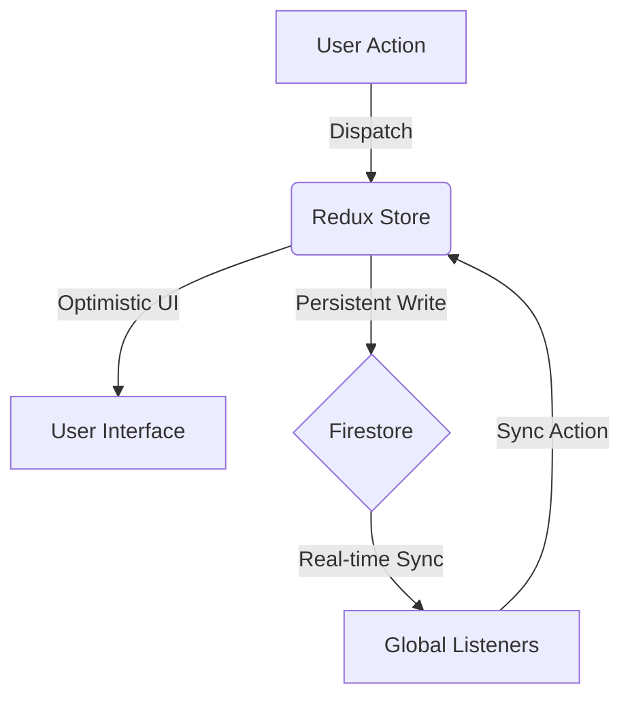

# PayMatrix 💎

[](https://react.dev/)
[](https://vitejs.dev/)
[](https://firebase.google.com/)
[](https://tailwindcss.com/)
[](https://lucide.dev/)
[](https://web.dev/progressive-web-apps/)

**PayMatrix** is a premium, high-density expense sharing and settlement platform engineered with the **Digital Obsidian** aesthetic. Designed for maximum efficiency, it simplifies group finances with real-time synchronization, deep analytical insights, and integrated UPI settlement workflows.

[**🌐 Live Platform**](https://pay-matrix.vercel.app/)

---

## ✨ Features

### 🌑 Digital Obsidian Interface
A state-of-the-art UI focused on information density and premium ergonomics.
- **Glassmorphism**: Refined frosted-glass architecture for modals and navigation.
- **Micro-Animations**: Buttery-smooth transitions powered by `Framer Motion`.
- **Haptic Responsiveness**: Optimized for mobile as a fully capable PWA.

### 💰 Precision Split Engine
Sophisticated debt resolution logic that handles complex financial webs.
- **Flexible Distribution**: Split equally, by fixed amounts, or by exact percentages.
- **Multi-Payer Logic**: Advanced support for expenses funded by multiple members.
- **Greedy Debt Simplification**: Proprietary algorithm that minimizes total transactions required to settle.

### ⚡ Integrated Settlements
Close the loop in seconds with direct banking integration.
- **Native UPI Deep-Linking**: Generate direct payment triggers for GPay, PhonePe, and Paytm.
- **Dynamic QR Generation**: Offline-ready scannable codes for instant transfers.
- **Preferred App Selection**: Set your primary payment vector (GPay, BHIM, etc.) globally.

### 📈 Advanced Analytics
Transform raw expenses into actionable financial intelligence.
- **Interactive Dashboards**: Visualize categorical spending trends using `Chart.js`.
- **Cohort Analysis**: Track member contributions and consumption ratios in real-time.
- **Audit Reports**: Export professional PDF security reports covering all expenses and logs.

### 🔒 Enterprise-Grade Security
Built on a foundation of trust and validation.
- **Network Severing**: "Security Zone" features to instantly terminate connections with any node.
- **Schema Enforcement**: 100% data validation via `Zod` before system entry.
- **Audit Integrity**: Immutable sub-collection logging for every administrative action.

---

## 🛠️ Technical Stack

| Category | Technology |
| :--- | :--- |
| **Foundation** | React 19.1, Vite 6.3, React Router 7.5 |
| **State** | Redux Toolkit 2.6, Redux Persist 6.0 |
| **Backend** | Firebase 12.11 (Firestore, Auth, Storage) |
| **Motion** | Framer Motion 12.6 |
| **Visualization** | Chart.js 4.5, React Chartjs 2 |
| **Reporting** | jsPDF, jspdf-autotable, json-2-csv |
| **Security** | Zod, DOMPurify, Rate Limiting (Distributed) |
| **Styling** | Tailwind CSS 3.4, Lucide React 1.7 |

---

## 🏗️ Hybrid Sync Architecture

PayMatrix utilizes a **Push-First Hybrid Sync** model to ensure zero-latency interactions even in unstable network conditions.



1. **Optimistic Updates**: The UI reflects changes immediately via Redux actions.
2. **Transactional Writes**: Services commit data to Firestore with conflict resolution.
3. **Snapshot Listeners**: Real-time listeners in `AppLayout` detect remote changes.
4. **State Reconciliation**: Dispatchers update the Redux store to ensure all clients are perfectly mirrored.

---

## 📊 Database Topology (Firestore)

### 📂 Collection Hierarchy
- **`users/{userId}`**: 
  - `upiId`: Primary settlement address.
  - `preferredApp`: Default payment vector (GPay/Paytm/etc).
  - `friends`: Verified network connections.
- **`groups/{groupId}`**: 
  - `members`: Active participant nodes.
  - **`expenses/`**: Recursive financial line items.
  - **`settlements/`**: Transactional balance resolutions.
  - **`logs/`**: Immutable event stream for group activity.
- **`friendRequests/`**: Transient handshakes for network growth.
- **`rate_limits/{userId}`**: Distributed enforcement for security-sensitive actions.

---

## 📂 Project Structure

```text
PayMatrix/
├── frontend/             # React/Vite Premium Interface
│   ├── src/
│   │   ├── components/   # Atomic UI units (Common, Group, Expense)
│   │   ├── hooks/        # Reactive logic (Online status, Auth, Profile)
│   │   ├── pages/        # View controllers (Analytics, Dashboard, Friends)
│   │   ├── redux/        # Global state orchestration
│   │   ├── services/     # API & Firebase abstraction layer
│   │   ├── utils/        # Computational engines (Balance, Export, UPI)
│   │   └── index.css     # Digital Obsidian design tokens
├── scripts/              # Infrastructure & Maintenance
│   └── clearFirestore.js # Database housekeeping utilities
├── firestore.rules       # Security layer declarations
└── LICENSE               # MIT License
```

---

## 🚀 Getting Started

### ⚙️ Local Development

1. **Clone & Navigate**:
   ```bash
   git clone https://github.com/Marshmellow31/PayMatrix.git
   cd PayMatrix/frontend
   ```

2. **Initialize Environment**:
   ```bash
   cp .env.example .env
   # Populate with your Firebase config
   ```

3. **Deploy Engine**:
   ```bash
   npm install
   npm run dev
   ```

### 📜 Environment Variables
| Key | Description |
| :--- | :--- |
| `VITE_FIREBASE_API_KEY` | Your Firebase project API key |
| `VITE_API_URL` | Optional backend proxy for advanced rate limiting |

---

## 🛡️ Security Posture

> [!IMPORTANT]
> To maintain the integrity of financial data, PayMatrix enforces a multi-layer security protocol:
> - **Input Hardening**: `DOMPurify` strips XSS vectors from all user-generated fields.
> - **Schema Guard**: `Zod` prevents malformed objects from reaching the settlement engine.
> - **Distributed Rate Limiting**: Multi-device protection against invitation and expense spam.
> - **Node Verification**: Email verification is mandatory for all primary account identifiers.

---

## 📄 License & Legal

Distributed under the **MIT License**. PayMatrix is a financial utility; users are responsible for verifying payment recipients within their respective banking applications.

Designed & Engineered with ❤️ by **Harshil**.
