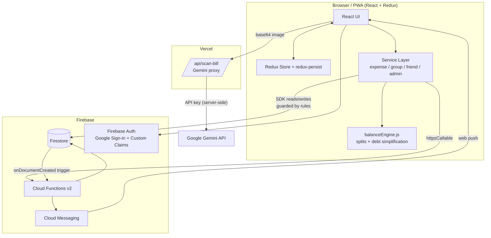
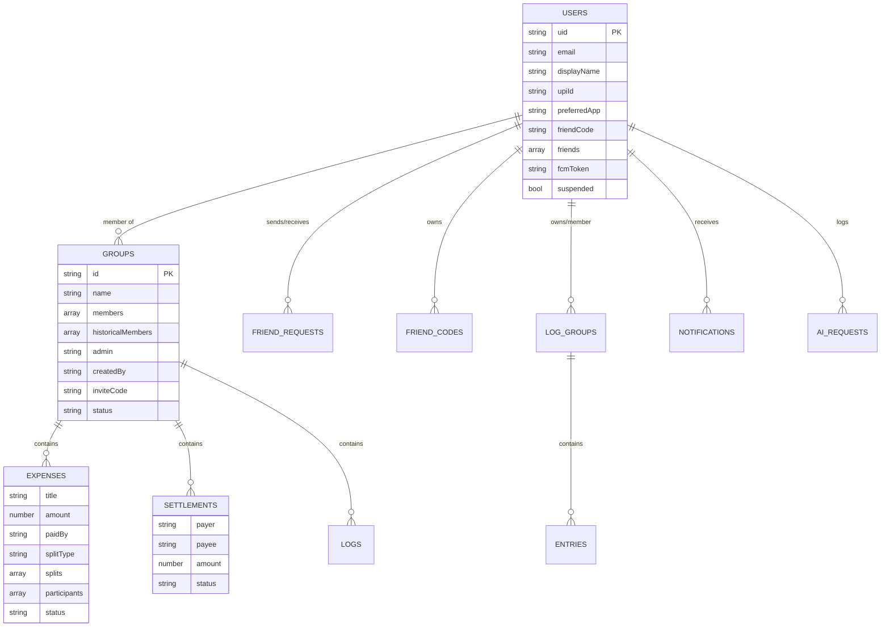
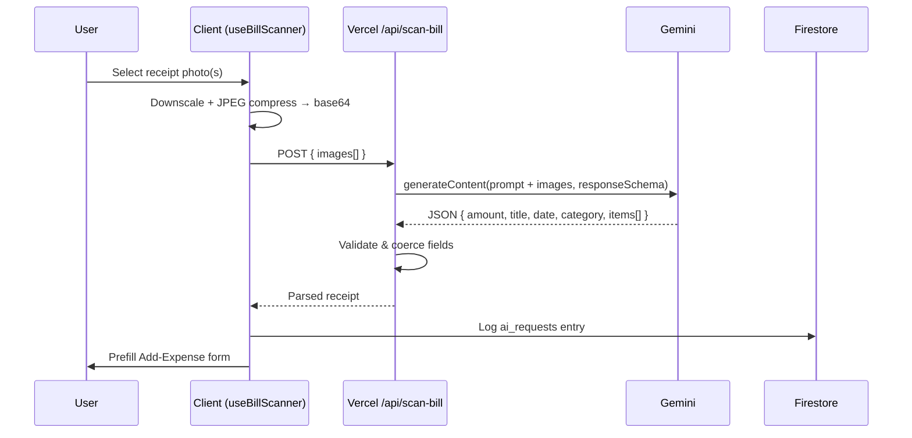
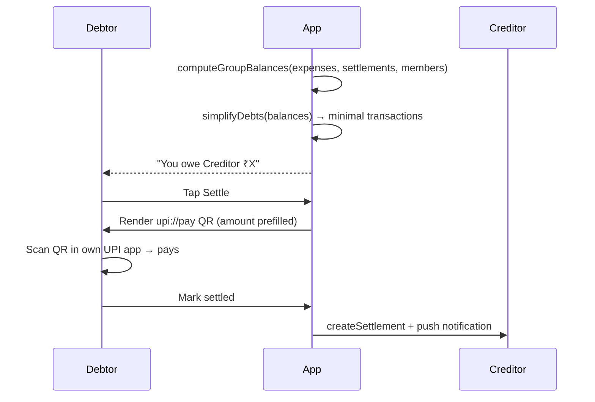
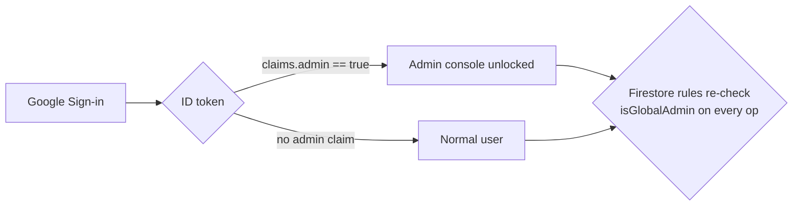

# PayMatrix 💎

[](https://react.dev/)
[](https://vitejs.dev/)
[](https://firebase.google.com/)
[](https://tailwindcss.com/)
[](https://web.dev/progressive-web-apps/)
[](https://github.com/Marshmellow31/PayMatrix/releases/latest)
[](./LICENSE)

**AI-powered expense sharing with direct UPI settlements.**

PayMatrix is a mobile-first Progressive Web App for splitting shared expenses, tracking who owes whom, and settling up over UPI. It uses Google's Gemini models to scan paper/PDF receipts into itemized expenses, a debt-simplification engine to minimise the number of payments a group needs to settle, and Firebase Cloud Messaging for real-time push notifications.

> [!NOTE]
> This README is intentionally exhaustive: it documents every feature, how it works internally, the data model, the security model, and how to run the project. If you are evaluating the code, also read [`SECURITY_AND_CODE_REVIEW.md`](./SECURITY_AND_CODE_REVIEW.md) — it lists known security issues and a prioritised improvement plan.

> [!WARNING]
> **Device-testing release: native Android app.** The separate Capacitor/Android project lives in
> [`android app/`](./android%20app/); the existing React PWA remains in [`frontend/`](./frontend/)
> and its Vercel configuration is unchanged. The signed Android 1.2.3 APK is available for direct
> device testing, but it is not yet a Play Store release.

[**🌐 Live app**](https://pay-matrix.vercel.app/) · [**📱 Download Android APK 1.2.3**](https://github.com/Marshmellow31/PayMatrix/releases/download/v1.2.3/paymatrix-1.2.3.apk) · [**Release notes**](https://github.com/Marshmellow31/PayMatrix/releases/tag/v1.2.3)

### Latest Android release

- Version: **1.2.3** (`versionCode 10203`)
- Package: `com.paymatrix.app`
- Signed APK: [`paymatrix-1.2.3.apk`](https://github.com/Marshmellow31/PayMatrix/releases/download/v1.2.3/paymatrix-1.2.3.apk)
- SHA-256: `c2e80135c458200d83dcfaec16bd4e1d27a92eb7ccfbccc46b74be58e54c52a3`

This is a direct-install device-testing release, not a Play Store publication. Android may ask you
to allow installation from the browser or file manager used to open the APK.

---

## Table of Contents

1. [What PayMatrix Does](#-what-paymatrix-does)
2. [Feature Deep-Dive](#-feature-deep-dive)
3. [Tech Stack](#-tech-stack)
4. [System Architecture](#-system-architecture)
5. [Data Model (Firestore)](#-data-model-firestore)
6. [Key Flows (Diagrams)](#-key-flows)
7. [The Balance & Settlement Engine](#-the-balance--settlement-engine)
8. [Security Model & Safety Precautions](#-security-model--safety-precautions)
9. [Project Structure](#-project-structure)
10. [Getting Started](#-getting-started)
11. [Environment Variables](#-environment-variables)
12. [Deployment](#-deployment)
13. [Admin Console](#-admin-console)
14. [Testing & Tooling](#-testing--tooling)
15. [Known Limitations](#-known-limitations)

---

## 🎯 What PayMatrix Does

At its core PayMatrix solves one problem: **"a group of people spent money together — who pays whom, and how little effort can that take?"**

- **Groups (cohorts):** create a group, add members, log shared expenses.
- **Splits:** split each expense equally, by exact amount, by percentage, by shares, or itemized (restaurant-style, tax distributed proportionally).
- **Balances:** the app continuously computes the net balance for every member from all expenses and settlements.
- **Simplification:** instead of everyone paying everyone, a greedy min-cash-flow algorithm collapses the debt web into the fewest possible transactions.
- **Settle up:** each owed payment produces a UPI QR code the payer scans in their own bank app, plus a copy-UPI-ID fallback.
- **AI receipt scanning:** photograph a bill (or several photos of a long bill) and Gemini extracts the total, merchant, date, category, and line items.
- **Personal Log Groups:** lightweight shared spending timelines (e.g. "Parents", "Roommates") that are not full split-groups — just a running ledger.
- **Friends network:** connect with other users to see cross-group net balances.
- **Push notifications:** OS-level alerts for new expenses, settlements, and friend requests.
- **Admin console:** platform operators can view stats, manage users/groups, broadcast notifications, and inspect security & AI-scan logs.

---

## ✨ Feature Deep-Dive

### 🤖 AI Bill Scanning
Photograph a receipt and skip manual entry.
- The client (`useBillScanner.js`) compresses the image on-device — downscaled to ≤1600px on the longest side and re-encoded to JPEG at 0.85 quality — to keep the upload small.
- It POSTs the base64 image(s) to a **serverless endpoint** (`frontend/api/scan-bill.js`, a Vercel function) which calls Gemini with a strict JSON `responseSchema`.
- **Multi-photo stitching:** you can pass several overlapping photos of one long receipt; the prompt instructs Gemini to merge them into a single de-duplicated item list.
- The response is validated field-by-field server-side (amount coerced to a positive number, date must match `YYYY-MM-DD`, category constrained to a fixed enum, items filtered to `{name, price>0}`).
- Every scan is logged to the `ai_requests` collection with status, duration, and parsed amount for admin analytics.

> **AI path:** there is a **single** server-side AI endpoint — the Vercel function `frontend/api/scan-bill.js` — which holds the Gemini key in server env only. The duplicate `scanBillWithGemini` Cloud Function was removed. Verify the model id in that file against the current Gemini model list before deploying.

### 💰 Precision Split Engine
Implemented in `utils/balanceEngine.js`.
- **Equal** — total divided evenly across participants.
- **Exact** — each participant assigned a fixed amount.
- **Percentage** — each participant assigned a %, amounts derived from the total.
- **Shares** — weighted split (e.g. 2:1:1).
- **Itemized** — each person's dish/item cost is entered; the *entire* bill total (including GST/service charge) is distributed proportionally to each dish, so pricier dishes absorb more tax. Rounding drift is absorbed by the last participant so splits always re-sum to the stored total.

### ⚡ Direct UPI Settlements
Implemented in `utils/upiUtils.js`.
- Generates a `upi://pay?pa=…&pn=…&am=…&cu=INR` string rendered as a **QR code** (`qrcode.react`).
- **Why QR and not a deep link?** NPCI/UPI risk engines flag third-party apps that *push* a payment to a **personal** VPA via deep link ("payment failed as per UPI risk policy"). A QR the payer scans inside their **own** app is a user-initiated *pull* and is not flagged. PayMatrix therefore deliberately uses QR + copy-UPI-ID instead of app-intent deep links for P2P settle-up.
- Users pick a preferred app label (GPay, PhonePe, Paytm, BHIM) for display; the QR itself is app-agnostic.

### 📊 Analytics
- **Dashboard/Analytics** pages visualise category spend, spending trends, and per-friend ledgers using Chart.js.

### 🔔 Push Notifications
- The client registers an FCM token (`usePushNotifications.js`, `fcmService.js`) and stores it on the user document.
- Writing a document to `notifications/{id}` triggers the `sendPushOnNotification` Cloud Function, which looks up the recipient's FCM token and delivers a web-push with a deep link to the relevant screen.
- Stale/invalid tokens are auto-cleaned when FCM reports them unregistered.

### 📄 Exports
- `utils/exportUtils.js` with `jsPDF` + `jspdf-autotable` and `json-2-csv` produce PDF/CSV reports of expenses, settlements, and logs.

### 🔒 Admin & Moderation
- Custom-claim-gated admin console: platform stats, paginated user & group management, force-archive/delete groups, broadcast push, security-log and AI-scan viewers, and feature-flag toggles.

---

## 🛠 Tech Stack

| Category | Technology |
| :--- | :--- |
| **Frontend** | React 19.1, Vite 6.3, React Router 7.5 |
| **State** | Redux Toolkit 2.6, React-Redux 9, Redux-Persist 6 (localStorage) |
| **Backend** | Firebase 12.11 — Firestore, Auth (Google), Cloud Functions v2, FCM, Storage |
| **Serverless** | Vercel Functions (`/api/scan-bill`) for the Gemini proxy |
| **AI / OCR** | Google Gemini (`*-flash-lite`) via server-side proxy |
| **Motion / UI** | Framer Motion 12, Tailwind CSS 3.4, Lucide React |
| **Charts** | Chart.js 4.5 + react-chartjs-2 |
| **Reporting** | jsPDF, jspdf-autotable, json-2-csv |
| **Validation / Safety** | Zod 4, DOMPurify 3, QR via qrcode.react |
| **PWA** | vite-plugin-pwa (Workbox service worker) |
| **Testing** | Vitest |

---

## 🏗 System Architecture

PayMatrix is a **client-heavy** app: most business logic (balances, splits, summaries) runs in the browser against Firestore directly, with Cloud Functions and a Vercel serverless function used only where trust or secrets are required (push, admin operations, AI key protection).


```mermaid
flowchart TD
    subgraph Client["Browser / PWA (React + Redux)"]
        UI[React UI]
        RDX[Redux Store + redux-persist]
        SVC[Service Layer<br/>expense / group / friend / admin]
        ENG[balanceEngine.js<br/>splits + debt simplification]
        UI <--> RDX
        UI --> SVC
        SVC --> ENG
    end

    subgraph Firebase["Firebase"]
        FS[(Firestore)]
        AUTH[Firebase Auth<br/>Google Sign-in + Custom Claims]
        FCM[Cloud Messaging]
        CF[Cloud Functions v2]
    end

    subgraph Vercel["Vercel"]
        API[/api/scan-bill<br/>Gemini proxy/]
    end

    GEM[Google Gemini API]

    SVC -- SDK reads/writes<br/>guarded by rules --> FS
    UI --> AUTH
    SVC -- httpsCallable --> CF
    CF --> FS
    CF --> FCM
    FCM -- web push --> UI
    FS -- onDocumentCreated trigger --> CF
    UI -- base64 image --> API
    API -- API key (server-side) --> GEM
```

**Hybrid sync model:** the UI updates optimistically via Redux, writes to Firestore, and `onSnapshot` listeners in `AppLayout`/`App.jsx` reconcile remote changes back into the store so multiple devices stay mirrored. Firestore offline persistence (`persistentLocalCache`) means reads/writes resolve from cache when offline and sync later.

---

## 🗂 Data Model (Firestore)


```mermaid
erDiagram
    USERS ||--o{ GROUPS : "member of"
    USERS ||--o{ FRIEND_REQUESTS : "sends/receives"
    USERS ||--o{ FRIEND_CODES : "owns"
    USERS ||--o{ LOG_GROUPS : "owns/member"
    GROUPS ||--o{ EXPENSES : contains
    GROUPS ||--o{ SETTLEMENTS : contains
    GROUPS ||--o{ LOGS : contains
    LOG_GROUPS ||--o{ ENTRIES : contains
    USERS ||--o{ NOTIFICATIONS : receives
    USERS ||--o{ AI_REQUESTS : logs

    USERS {
        string uid PK
        string email
        string displayName
        string upiId
        string preferredApp
        string friendCode
        array  friends
        string fcmToken
        bool   suspended
    }
    GROUPS {
        string id PK
        string name
        array  members
        array  historicalMembers
        string admin
        string createdBy
        string inviteCode
        string status
    }
    EXPENSES {
        string title
        number amount
        string paidBy
        string splitType
        array  splits
        array  participants
        string status
    }
    SETTLEMENTS {
        string payer
        string payee
        number amount
        string status
    }
```

Additional top-level collections: `security_logs` (append-only client-written audit events), `rate_limits/{uid}` (server-writable counters), `config/featureFlags`, `admin_notifications`, and `friendCodes/{code}` (exact-code friend lookup, list disabled to prevent enumeration).

---

## 🔁 Key Flows

### Bill scan → expense


```mermaid
sequenceDiagram
    participant U as User
    participant C as Client (useBillScanner)
    participant V as Vercel /api/scan-bill
    participant G as Gemini
    participant F as Firestore

    U->>C: Select receipt photo(s)
    C->>C: Downscale + JPEG compress → base64
    C->>V: POST { images[] }
    V->>G: generateContent(prompt + images, responseSchema)
    G-->>V: JSON { amount, title, date, category, items[] }
    V->>V: Validate & coerce fields
    V-->>C: Parsed receipt
    C->>F: Log ai_requests entry
    C->>U: Prefill Add-Expense form
```

### Settle up


```mermaid
sequenceDiagram
    participant D as Debtor
    participant A as App
    participant Cr as Creditor

    A->>A: computeGroupBalances(expenses, settlements, members)
    A->>A: simplifyDebts(balances) → minimal transactions
    A-->>D: "You owe Creditor ₹X"
    D->>A: Tap Settle
    A->>D: Render upi://pay QR (amount prefilled)
    D->>D: Scan QR in own UPI app → pays
    D->>A: Mark settled
    A->>Cr: createSettlement + push notification
```

### Auth & admin gating


```mermaid
flowchart LR
    L[Google Sign-in] --> T{ID token}
    T -->|claims.admin == true| ADM[Admin console unlocked]
    T -->|no admin claim| USR[Normal user]
    ADM --> RULES{Firestore rules re-check<br/>isGlobalAdmin on every op}
    USR --> RULES
```

Admin authority is enforced **server-side** by Firestore rules and Cloud Functions checking the `admin` custom claim — the client UI gate is only a convenience layer.

---

## 🧮 The Balance & Settlement Engine

`utils/balanceEngine.js` is the financial core.

1. **`computeGroupBalances(expenses, settlements, members)`** → a map of `uid → net balance`.
   - For each expense split, the payer is credited and each participant debited their share.
   - Settlements move balance from payer to payee.
   - Deleted/archived records are skipped; all arithmetic is rounded to 2 decimals to avoid float drift.
2. **`simplifyDebts(balances)`** → the minimal transaction list.
   - Splits members into creditors (positive) and debtors (negative), sorts both descending, and greedily matches the largest creditor with the largest debtor until settled. Dust below ₹0.01 is ignored.
   - This is a greedy min-cash-flow heuristic — near-optimal and O(n log n), which is the right trade-off for real-world group sizes.
3. **`calculateSplits(...)`** → converts a chosen split type into the concrete `splits[]` array stored on the expense.

There is a unit test at `utils/balanceEngine.test.js` (run with `npm test`).

---

## 🛡 Security Model & Safety Precautions

PayMatrix has a layered defence model. The high/medium issues from the initial review have been remediated — see [`SECURITY_AND_CODE_REVIEW.md`](./SECURITY_AND_CODE_REVIEW.md) for the full findings list and their fix status.

**Authentication & Authorization**
- Google Sign-in via Firebase Auth; email verification is inherent to Google accounts.
- Platform-admin access is granted only via Firebase **Custom Claims** (`token.admin == true`). There is no UID allow-list fallback in the rules or functions.
- Every Cloud Function that performs privileged work re-checks `request.auth.token.admin`.

**Firestore Security Rules** (`firestore.rules`)
- Users can only read their own profile or a friend's; group data is readable only by members (or historical members).
- Amount/length validation helpers (`isValidAmount ≤ 1,000,000`, string length caps) are enforced on writes.
- Group `logs` are immutable (`update, delete: if false`); `security_logs` and `ai_requests` are append-only.
- `rate_limits` are readable by the owner but writable only by admins/functions, so users cannot reset their own counters.
- Friend codes cannot be listed (no enumeration) — you must know the exact 8-char code.

**Input Hardening**
- `sanitizationService` runs DOMPurify over all user-supplied strings (tags/attrs stripped) before persistence.
- `validationService` enforces Zod schemas on expenses, groups, friend requests, and log entries.
- Any AI/markdown output is rendered through DOMPurify before insertion into the DOM.

**Transport & Headers** (`vercel.json`)
- Strict `Content-Security-Policy`, `Strict-Transport-Security` (2-year preload), `X-Frame-Options: DENY`, `X-Content-Type-Options: nosniff`, `Referrer-Policy: no-referrer`.

**Payment Safety**
- PayMatrix never moves money itself. It only generates a UPI QR/string; the actual transfer happens inside the user's own bank app. Users are responsible for verifying the recipient VPA before paying.

**Rate Limiting**
- `rateLimitService` uses a Firestore transaction to cap sensitive actions per user/time-window. It **fails closed**: if the check errors it denies the action, except when the device is genuinely offline (where the write is queued by Firestore persistence anyway).

---

## 📂 Project Structure

```text
PayMatrix/
├── frontend/                     # React / Vite PWA
│   ├── api/
│   │   └── scan-bill.js          # Vercel serverless Gemini proxy
│   ├── src/
│   │   ├── components/           # UI units (common, group, expense, logs, charts, layout)
│   │   ├── config/firebase.js    # Firebase SDK initialization
│   │   ├── hooks/                # useAuth, useAdminAuth, useBillScanner, usePushNotifications …
│   │   ├── pages/                # Dashboard, Groups, Analytics, admin/* …
│   │   ├── redux/                # store + auth/group/expense/notification slices
│   │   ├── services/             # Firebase abstraction (expense, group, friend, admin, auth, …)
│   │   └── utils/                # balanceEngine, upiUtils, exportUtils, formatCurrency …
│   ├── .env.example
│   └── vercel.json               # SPA rewrites + security headers
├── android app/                   # WIP native Android wrapper (kept separate from the PWA)
│   ├── android/                   # Capacitor-generated Gradle project
│   ├── docs/                      # Setup, Firebase, test, and release guides
│   └── README.md                  # Native build commands and required local files
├── functions/
│   └── index.js                  # Cloud Functions: push, admin ops, Gemini scan, notifications
├── scripts/                      # Admin/maintenance node scripts (set-admin, broadcast, …)
├── firestore.rules               # Firestore security rules
├── firebase.json / .firebaserc   # Firebase project config
└── LICENSE                       # MIT
```

---

## 🚀 Getting Started

### Prerequisites
- Node.js 18+ and npm
- A Firebase project (Firestore, Auth, Cloud Messaging, Functions enabled)
- A Google Gemini API key
- (Optional) Vercel account for the `/api/scan-bill` proxy

### Local development

```bash
# 1. Clone
git clone https://github.com/Marshmellow31/PayMatrix.git
cd PayMatrix/frontend

# 2. Configure environment
cp .env.example .env
#    → fill in your Firebase web config + VAPID key

# 3. Install & run
npm install
npm run dev            # http://localhost:5173
```

### Firebase Functions (push, admin ops, server-side scan)

```bash
cd ../functions
npm install
firebase functions:secrets:set GEMINI_API_KEY     # server-side AI key
firebase deploy --only functions
firebase deploy --only firestore:rules            # publish security rules
```

### Native Android app (work in progress)

The Android wrapper is deliberately isolated in [`android app/`](./android%20app/), so web/PWA
development and Vercel deployment continue to use `frontend/` unchanged. It uses native Android
Google account selection rather than the web login popup, supports Android system Back navigation,
and is built through Gradle/Capacitor for the device refresh rate.

```powershell
cd "android app"
npm ci
npm run doctor
npm run android:apk
```

The debug APK is generated locally at
`android app/android/app/build/outputs/apk/debug/app-debug.apk`. Generated build output remains
ignored, while the signed direct-testing APK and checksum are attached to the
[`v1.2.3` GitHub release](https://github.com/Marshmellow31/PayMatrix/releases/tag/v1.2.3) and mirrored
under [`releases/`](./releases/). Follow
[`android app/README.md`](./android%20app/README.md) and its numbered docs for device setup.

**Firebase Spark-plan status:** native Google sign-in and Firestore work with the existing Firebase
project. Cloud Functions cannot be newly deployed on the Spark plan, so Android native push delivery
remains a future release item. The bill scanner uses the existing Vercel endpoint. Its Android CORS
and Firebase-token checks are committed in this branch, but the endpoint must be deployed through
the existing Vercel project before bill scanning works from the APK. This branch does not modify
`frontend/vercel.json` or deploy Vercel production.

### Granting yourself admin

```bash
cd ../scripts
# place your Firebase Admin SDK service account JSON at scripts/serviceAccountKey.json (gitignored)
node set-admin.js       # sets { admin: true } custom claim for the hard-coded email
```

---

## 🔑 Environment Variables

Client variables are prefixed `VITE_` and are **compiled into the browser bundle** (i.e. public). Never put a real secret behind a `VITE_` prefix.

| Key | Where | Public? | Description |
| :--- | :--- | :--- | :--- |
| `VITE_FIREBASE_API_KEY` | frontend/.env | Yes (safe) | Firebase web API key (identifies project; not a secret) |
| `VITE_FIREBASE_AUTH_DOMAIN` | frontend/.env | Yes | Firebase auth domain |
| `VITE_FIREBASE_PROJECT_ID` | frontend/.env | Yes | Firebase project id |
| `VITE_FIREBASE_STORAGE_BUCKET` | frontend/.env | Yes | Storage bucket |
| `VITE_FIREBASE_MESSAGING_SENDER_ID` | frontend/.env | Yes | FCM sender id |
| `VITE_FIREBASE_APP_ID` | frontend/.env | Yes | Firebase app id |
| `VITE_FIREBASE_VAPID_KEY` | frontend/.env | Yes | Web-push public VAPID key |
| `GEMINI_API_KEY` | Vercel / Functions env | **No — secret** | Server-side Gemini key for `/api/scan-bill` and functions |

> [!NOTE]
> There is intentionally **no** `VITE_GEMINI_API_KEY` or `VITE_ADMIN_PASSWORD`. The Gemini key lives only in server env (`GEMINI_API_KEY`) and every AI call goes through the server, so the key is never in the browser bundle. Admin access is granted exclusively via Firebase custom claims (`scripts/set-admin.js`) — there is no admin password. See [`SECURITY_AND_CODE_REVIEW.md`](./SECURITY_AND_CODE_REVIEW.md) for the full history of these hardening changes.

---

## ☁️ Deployment

- **Frontend + `/api`:** deployed to **Vercel** (SPA rewrites and security headers live in `frontend/vercel.json`). Set `GEMINI_API_KEY` and all `VITE_*` variables in the Vercel dashboard.
- **Functions & rules:** deployed to **Firebase** (`firebase deploy --only functions,firestore:rules`).
- `.firebaserc` / `firebase.json` pin the Firebase project.
- **Android WIP branch:** building and pushing the Android workspace does not alter the Vercel
  project. Deploy the Vercel project separately when the bill-scanner endpoint update is ready.

---

## 🧑‍💼 Admin Console

Reachable at `/admin` for users whose ID token carries the `admin` custom claim.

- **Dashboard** — user/group/notification/security/AI counts + 7-day signup trend.
- **Users** — paginated list, suspend/enable (disables Firebase Auth account), clear FCM token, grant/revoke admin.
- **Groups** — paginated via `adminListGroups`, drill into expenses/settlements, force archive/delete.
- **Notifications** — broadcast web-push to all users or a single UID (`broadcastNotification`), with history.
- **Security Logs** — filterable audit stream.
- **AI Scans** — per-scan status, latency, and cost estimate.
- **Feature Flags** — toggle features stored in `config/featureFlags`.

---

## 🧪 Testing & Tooling

```bash
cd frontend
npm test              # Vitest (includes balanceEngine.test.js)
npm run lint          # ESLint
npm run format        # Prettier
npm run build         # production build
```

---

## ⚠️ Known Limitations

- Debt simplification is a greedy heuristic (near-optimal, not provably minimal for pathological inputs).
- UPI settle-up is QR-based by design (personal-VPA deep links are blocked by UPI risk policy); there is no automated payment confirmation — a member marks a settlement manually.
- Editing an expense/settlement's financial fields is restricted to its creator (or the group admin); any member can still collaboratively soft-delete/restore. This favours integrity over free-for-all editing.

---

## 📄 License

Distributed under the **MIT License** (see [`LICENSE`](./LICENSE)). PayMatrix is a financial utility; users are responsible for verifying payment recipients within their own banking apps before transferring money.

Designed & engineered by **Harshil**.
