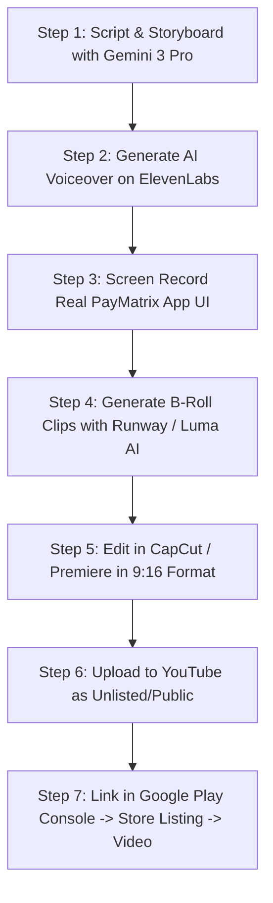

# PayMatrix — Google Play & Social Video Advertising Playbook (9:16 Format)

> **Document Status:** Operational Video Ad Production & Prompt Engineering Guide  
> **Format Focus:** 9:16 Full Vertical (1080×1920px) for Google Play Promo Video, YouTube Shorts, and Instagram Reels  
> **Visual Identity:** Digital Obsidian (#0e0e0e near-black, neon emerald `#10b981`, electric violet `#8b5cf6`, crisp sans-serif typography)

---

## 1. Google Play Store 9:16 Video Requirements & Specifications

Google Play allows developers to add a YouTube promo video to their store listing. With modern mobile users, vertical 9:16 YouTube Shorts deliver significantly higher conversion rates than outdated landscape 16:9 videos.

### Technical & Policy Specifications
1. **Host Platform:** YouTube (Must be set to Public or Unlisted).
2. **Aspect Ratio:** 9:16 Vertical (1080×1920 px or 4K 2160×3840 px).
3. **Ideal Duration:** **25 to 35 seconds**. Google Play users decide whether to install within the first 6 seconds.
4. **Muted Autoplay Compliance:** Google Play auto-plays videos **muted by default**. 
   - *Critical Rule:* Every video must use bold, high-contrast on-screen kinetic captions and text callouts so the value proposition is 100% understandable without sound.
5. **Monetization & Ads Disabled:** The linked YouTube video **must NOT have ads enabled** (Google Play will reject or fail to render monetized videos).
6. **No Device Frames / Notches:** Avoid fake iPhone or Galaxy frames; keep full-screen fluid UI and human reaction shots.
7. **Google Play Store Policy:** Avoid deceptive claims, competitor name-bashing (e.g. use "That other split app with 3-expense limits" instead of trademarked names in store listings), and display authentic UI interactions.

---

## 2. The High-Converting 9:16 Video Ad Architecture

Every successful mobile app ad follows the **Hook-Agitate-Demonstrate-Close (HADC)** formula tailored for fast-swiping audiences:

```mermaid
journey
    title 30-Second High-Conversion 9:16 User Journey
    section 0-3s: The Hook
      Relatable problem / Visual shock: 5: User stops scrolling
    section 3-8s: The Agitation
      Messy WhatsApp groups, awkward debt texts: 2: User feels the pain
    section 8-18s: The Magic Reveal
      Gemini AI bill scan, instant UPI QR: 9: User experiences "Aha!" moment
    section 18-25s: Proof & Delight
      Zero balance confetti, Obsidian UI: 8: User desires the app
    section 25-30s: Clear CTA
      "Install Free on Google Play": 9: User taps install
```

---

## 3. Master Gemini Prompt for Video Ad Scripting & Storyboards

Use this system prompt with Gemini 2.5 / 3 Pro to generate tailored video scripts and visual prompt breakdowns.

```markdown
### SYSTEM PROMPT: PayMatrix Video Creative Director

You are an elite Performance Creative Director specializing in viral Gen-Z/Millennial mobile fintech ads.
Your goal is to produce high-retention 9:16 video ad scripts for PayMatrix, a sleek expense-splitting app for India.

Key App Features:
1. Gemini-powered AI Bill Scanning: Snap a paper bill -> extracts items, tax, and totals in 2 seconds.
2. Settle via UPI QR: Shows a high-contrast UPI QR with the exact paise amount pre-filled.
3. Intelligent Min-Flow Engine: Simplifies 12 group debts into 2 direct transfers.
4. Dark "Digital Obsidian" UI: Minimalist, zero clutter, zero ads, 100% free.

Target Audience:
- Indian college students, young flatmates, Goa/travel friend groups (Ages 18–32).
- Tone: Natural, witty, relatable, conversational Indian English or Hinglish. No corporate jargon.

Output Requirements for Every Script:
1. Concept Name & Core Angle
2. Target Duration (Strictly 25–30s)
3. Shot-by-Shot Table:
   - Second / Timestamp
   - Visual Description (9:16 Framing & Action)
   - On-Screen Text (Kinetic typography for muted autoplay)
   - Voiceover / Audio FX
4. Exact Prompts for AI Video Generators (Runway Gen-3 / Luma / Sora) for every shot.
```

---

## 4. Five Production-Ready 9:16 Video Ad Concepts & Scripts

---

### Concept 1: "The Goa Trip Settlement Nightmare"
* **Target Audience:** Travel groups, college friends, young corporate workers.
* **Core Pain Point:** One person pays for hotel, someone else buys fuel, another pays dinner. Calculations take 4 days on WhatsApp.

| Time | Visual (9:16 Full Screen) | On-Screen Kinetic Text | Voiceover / Audio Cue |
| :--- | :--- | :--- | :--- |
| **0–3s** | POV phone camera: 4 friends in a beach cafe staring awkwardly at a massive ₹8,450 paper receipt. | *"Who's paying the bill?!"* | **SFX:** Awkward silence, distant ocean breeze.<br>**VO:** "The worst part of any Goa trip isn't the sunburn..." |
| **3–7s** | Fast cut to messy WhatsApp group chat: 20 unread voice notes, calculator screenshots, someone typing *"Wait, did Rohan drink 2 beers or 3?"* | *"12 spreadsheets later..."* | **VO:** "It's the 4-day WhatsApp math debate that follows." |
| **7–14s** | Hand holds phone running PayMatrix: Snaps the receipt with Gemini AI camera. Screen highlights items with glowing emerald bounding boxes in 1.5 seconds. | **⚡ AI Bill Scan in 2 Secs**<br>*- Auto extracts items & taxes* | **SFX:** High-tech digital chime.<br>**VO:** "Enter PayMatrix. Just snap the bill. Gemini AI extracts every line item instantly." |
| **14–20s** | Screen taps 4 avatar bubbles. Screen displays "Min-Flow Settlement": converts 14 tangled debts into 2 simple payments. | **🔥 14 Debts ➔ 2 Transfers** | **VO:** "Splits item-by-item down to the paise. No manual math." |
| **20–25s** | Friend opens camera, scans PayMatrix UPI QR on the phone screen. GPay confirmation appears: *"Paid ₹1,420"*. Screen bursts with obsidian confetti. | **All Settled Up! ✅** | **SFX:** UPI payment success ping.<br>**VO:** "Scan to settle via UPI. Done before the waiter even comes back." |
| **25–30s** | PayMatrix app icon on sleek obsidian background with Google Play badge and download arrow. | **PayMatrix**<br>Split Bills. Settle Instantly.<br>👉 **Install Free on Google Play** | **VO:** "Download PayMatrix free on Google Play. Keep friends, lose the math." |

---

### Concept 2: "The 3-Second Receipt Superpower"
* **Target Audience:** Tech lovers, dinner group organizers, busy professionals.
* **Core Pain Point:** Typing 15 items from a supermarket or restaurant bill manually is painful.

| Time | Visual (9:16 Full Screen) | On-Screen Kinetic Text | Voiceover / Audio Cue |
| :--- | :--- | :--- | :--- |
| **0–3s** | Close-up macro shot of a crumple-folded, faded thermal paper bill with 18 items. A finger tries to tap calculator frantically. | *"Typing 18 items manually?"* | **SFX:** Frantic keyboard tapping, timer ticking.<br>**VO:** "Still manually typing every single item from the restaurant bill?" |
| **3–8s** | Text: *"Stop doing that."* A sleek smartphone drops into frame over the receipt. | *"There's a smarter way."* | **VO:** "It's 2026. Let AI do the work." |
| **8–16s** | Camera UI in PayMatrix. Emerald scanning beam sweeps across the bill. Real-time recognition populates the itemized list: *Butter Chicken ₹450, Naan ₹80, Mocktail ₹220, GST 5%*. | **Powered by Gemini AI**<br>⚡ Instant Line-Item OCR | **SFX:** Futuristic digital laser scan chime.<br>**VO:** "PayMatrix uses Google Gemini AI to read the entire bill—including taxes and service charge." |
| **16–22s** | Finger drags "Rohan" to Butter Chicken, "Priya" to Mocktail. The total updates dynamically in real-time. | **Drag & Drop Item Splitting** | **VO:** "Drag who ate what. PayMatrix calculates everyone's exact share down to the paise." |
| **22–27s** | Settle Up modal pops up: Generates instant QR code for PhonePe / GPay. | **One-Tap UPI Settle** | **VO:** "Generate a UPI QR in one tap. Your friends scan, pay, and settle." |
| **27–30s** | App logo with animated neon glow and Google Play download CTA. | **PayMatrix**<br>Zero Ads. 100% Free.<br>📲 **Download on Play Store** | **VO:** "Get PayMatrix on the Google Play Store today." |

---

### Concept 3: "Ditch the Splitwise Paywall"
* **Target Audience:** Frustrated Splitwise users who hate the recent paywalls, daily expense limits, and 10-second ad countdowns.
* **Core Pain Point:** Popular expense apps locking basic features behind expensive subscriptions.

| Time | Visual (9:16 Full Screen) | On-Screen Kinetic Text | Voiceover / Audio Cue |
| :--- | :--- | :--- | :--- |
| **0–4s** | Hand holding a phone showing a mockup of a generic green app with a pop-up: *"You have reached your daily limit of 3 expenses. Wait 24 hours or upgrade to Pro."* | *"Daily limit reached?! For splitting a chai?!"* | **SFX:** Annoying error buzzer sound.<br>**VO:** "Wait... did your expense-splitting app really just paywall you for adding 3 expenses?" |
| **4–9s** | Frustrated person tosses phone on couch in disbelief. Cut to an unskippable 15-second ad timer counting down on screen. | *"And 15-second ads just to see your balance?!"* | **VO:** "And making you watch a video ad just to see who owes you ₹150?" |
| **9–18s** | Quick swipe up to reveal PayMatrix: Pitch-black Digital Obsidian interface, lightning-fast transitions, smooth 60fps animations. | **Meet PayMatrix 🖤**<br>✨ Zero Clutter. Zero Nonsense. | **SFX:** Deep bass drop, smooth whoosh.<br>**VO:** "Switch to PayMatrix. No daily limits. No ads. Just a ridiculously fast, dark-mode split ledger." |
| **18–25s** | Quick cuts: Adding an expense in 2 taps, Gemini AI bill scan, UPI settlement QR generated in 1 second. | **✅ Unlimited Expenses**<br>**✅ Gemini AI Bill Scan**<br>**✅ UPI QR Built-in** | **VO:** "Unlimited groups, smart min-flow settlements, and AI receipt scanning built right in." |
| **25–30s** | Final CTA screen with Google Play Store badge and animated neon download button. | **The Upgrade You Deserved**<br>👉 **Get PayMatrix on Google Play** | **VO:** "Upgrade your group finances. Download PayMatrix free on Google Play." |

---

### Concept 4: "Flatmate Rent & Grocery Chaos"
* **Target Audience:** Roommates and flatmates sharing apartments in Bengaluru, Mumbai, Pune, Delhi NCR, Hyderabad.
* **Core Pain Point:** Who bought the WiFi router? Who paid maid salary? Who bought the cooking oil?

| Time | Visual (9:16 Full Screen) | On-Screen Kinetic Text | Voiceover / Audio Cue |
| :--- | :--- | :--- | :--- |
| **0–4s** | Flat kitchen fridge covered with 14 crumpled post-it notes and faded grocery receipts falling off. | *"Living with flatmates be like..."* | **SFX:** Refrigerator door slamming shut.<br>**VO:** "If your flatmate expense tracking looks like this fridge..." |
| **4–9s** | Split screen: Roommate 1 on bed: *"Did you pay WiFi?"* Roommate 2 cooking: *"I thought you paid maid salary!"* | *"Who owes who?!"* | **VO:** "...you're definitely losing money every single month." |
| **9–17s** | Phone screen opens PayMatrix "Flat 402 — Indiranagar" group. Shows clean balance overview: *Aditya owes ₹1,200 | Vikram gets ₹2,400*. | **One Shared Flat Ledger 🏠** | **SFX:** Soft melodic notification chime.<br>**VO:** "Create a shared flat group on PayMatrix. Rent, groceries, maid, electricity—all synced in real time." |
| **17–24s** | Roommate taps "Settle Up" -> Instant UPI QR appears on screen. Other roommate scans it from their GPay. Balance updates to ₹0.00 instantly with a checkmark. | **⚡ Settle with 1 Scan**<br>*No phone numbers needed* | **SFX:** Satisfying cash register ding.<br>**VO:** "Settle your share directly to their UPI in one scan. No awkward reminders needed." |
| **24–30s** | End card with flatmate smiling, holding phone showing zero debt. | **Flat Peace Restored 🕊️**<br>📲 **Install PayMatrix Free** | **VO:** "Keep the flat peaceful. Download PayMatrix free on the Google Play Store." |

---

### Concept 5: "The Awkward ₹340 Dinner Debt"
* **Target Audience:** Everyone who feels awkward asking friends for small amounts of owed money.
* **Core Pain Point:** Social embarrassment of reminding someone about money.

| Time | Visual (9:16 Full Screen) | On-Screen Kinetic Text | Voiceover / Audio Cue |
| :--- | :--- | :--- | :--- |
| **0–4s** | Close up of a guy biting his nails, staring at his phone, typing and backspacing: *"Hey bro, about yesterday's dinner..."* | *"The awkward 'Hey bro, pay me back' text 💀"* | **SFX:** Nervous clock ticking.<br>**VO:** "Nothing is more painful than sending that awkward text asking a friend for ₹340." |
| **4–8s** | The guy sighs and deletes the message. | *"Don't be the bad guy."* | **VO:** "Stop being the debt collector in your friendship." |
| **8–18s** | He opens PayMatrix, adds "BIRYANI DINNER", selects friend. PayMatrix sends an automated sleek push notification to the friend's phone: *"Rahul added Biryani: Your share is ₹340."* | **Let PayMatrix Ask For You 🤖** | **SFX:** Clean iOS/Android push sound.<br>**VO:** "Let PayMatrix handle it. We send a clean, neutral notification with the exact breakdown." |
| **18–25s** | The friend taps the notification, scans the pre-filled UPI QR, and pays in 5 seconds. Payer's phone immediately lights up: *"Settlement Confirmed ✅"*. | **1-Tap UPI Settle Up** | **VO:** "They tap, scan UPI, and settle before it ever gets awkward." |
| **25–30s** | PayMatrix logo with Google Play badge and download prompt. | **Save The Friendship. Settle The Bill.**<br>👉 **Download on Google Play** | **VO:** "Save your friendships and your wallet. Install PayMatrix free today." |

---

## 5. Exact Prompts for AI Video & Image Generators (9:16 Format)

Use these exact prompts when generating vertical video clips and screenshot mockups using tools like **Gemini Imagen 3, Runway Gen-3 Alpha, Luma Dream Machine, Sora, or Midjourney v6**.

---

### 5.1 AI Video Generation Prompts (Runway Gen-3 / Luma / Sora)

#### Shot: Receipt Scanning with Laser Beam (AI OCR Moment)
```
Close-up vertical 9:16 camera shot. A high-end matte black smartphone held in a young person's hand hovering over a printed restaurant paper bill on a dark walnut cafe table. The phone screen displays an ultra-modern dark-mode camera interface with an emerald-green laser scanning line moving smoothly down the paper receipt. Glowing futuristic AR bounding boxes illuminate numbers and item text on the receipt. Cinematic volumetric cafe lighting, shallow depth of field, 4K resolution, photorealistic, 60fps --ar 9:16
```

#### Shot: Awkward Group at Restaurant Table (The Problem Hook)
```
Vertical 9:16 cinematic video. Four diverse young friends in trendy casual attire sitting around a cozy dinner table in a dimly lit modern cafe. A white paper receipt rests on a small brass tray in the center. They exchange awkward, hesitant glances, pointing at the bill, smiling nervously with hands raised in playful confusion. Warm amber overhead pendant lighting, shallow depth of field, cinematic 35mm lens, natural spontaneous acting, photorealistic --ar 9:16
```

#### Shot: Phone Screen UPI QR Payment (The Solution Action)
```
Vertical 9:16 macro shot of a sleek smartphone screen displaying a bright, high-contrast monochrome UPI QR code inside a minimalist dark-mode fintech app ("PayMatrix"). Another smartphone camera enters frame from the top, aligns with the QR code, and instantly triggers a green checkmark payment confirmation animation with floating celebratory particles. Crisp neon emerald and deep obsidian reflections, sharp focus, 4K --ar 9:16
```

#### Shot: Flatmates in Modern Living Room (Relatable Flatmate Hook)
```
Vertical 9:16 cinematic medium shot. Two young urban roommates in a contemporary apartment living room. One is sitting on a sofa looking at an electricity bill, the other is holding a grocery bag, smiling and showing each other a smartphone app with a dark obsidian UI. Clean Scandinavian interior decor, soft morning natural window light, cinematic film grain, hyper-realistic, 4K --ar 9:16
```

---

### 5.2 Gemini Imagen 3 / Midjourney Master Prompt for 9:16 Promo Banners & Posters

```
A professional vertical 9:16 advertising poster for an Indian fintech mobile app called PayMatrix.

DIMENSIONS & RATIO:
- Strict 9:16 portrait ratio (1080x1920 pixels). Vertical orientation.

AESTHETIC & PALETTE:
- Digital Obsidian theme: Background is deep pitch-black (#0a0a0a) with subtle brushed titanium carbon textures.
- Accent colors: Radiant neon emerald green (#10b981) and subtle violet ambient glows.
- Minimalist, premium, futuristic, uncluttered design.

MAIN COMPOSITION:
- Center: A photorealistic floating black smartphone displaying a dark-mode expense settlement screen showing "+₹1,450 Settled" with a glowing emerald checkmark and a clean UPI QR code.
- Top-third: Bold kinetic modern sans-serif typography (Manrope font style) in bright off-white: "SPLIT BILLS IN SECONDS." with a smaller subheadline in soft silver: "Powered by Gemini AI Bill Scanning".
- Bottom-third: Prominent "GET IT ON Google Play" official badge, crisp and centered, above an emerald download arrow.

LIGHTING & MOOD:
- Soft directional studio rim-lighting outlining the phone edge.
- Subtle floating 3D coins and faint holographic receipt elements drifting behind the phone with elegant motion blur.
- No clutter, no distracting cartoon elements, ultra-high-end luxury fintech visual. --ar 9:16
```

---

## 6. End-to-End Production & Google Play Publishing Workflow



### Step-by-Step Execution Guide

#### Step 1: Script Finalization
Choose one of the 5 concepts above (e.g. Concept 2: "The 3-Second Receipt Superpower" is the #1 highest-converting for cold traffic).

#### Step 2: Professional AI Voiceover (Cost: Free / ₹0)
1. Go to **ElevenLabs** (free tier includes 10,000 characters/month).
2. Recommended Voices:
   - Voice: *"Adam"* or *"Fin"* (Conversational, friendly, natural pace).
   - Alternatively, an Indian English accent voice like *"Aarav"* or *"Aditi"*.
3. Settings: Stability: 45%, Clarity: 75%, Style Exaggeration: 15%.
4. Export as 48kHz WAV audio.

#### Step 3: Screen Record the Real PayMatrix UI
1. Open Chrome DevTools or the Android device. Set screen size to `1080×2400` or `1080×1920`.
2. Turn on Dark Theme.
3. Record smooth 60fps screen recordings of:
   - Snapping a sample restaurant bill.
   - The line items populating in `BillScannerModal.jsx`.
   - The Settle Up modal opening with the dynamic UPI QR code.
   - Marking a settlement as confirmed with the green status badge.

#### Step 4: Video Assembly in CapCut or DaVinci Resolve (Free)
1. Set project resolution to **1080×1920 (9:16 Vertical)**.
2. Place Voiceover on Audio Track 1.
3. Add a punchy, copyright-free lofi/phonk/hip-hop background beat at -18dB (e.g. from YouTube Audio Library).
4. Synchronize cuts: Change visual scene every **2 to 3 seconds**.
5. Enable **Auto-Captions**: Choose bold uppercase font (e.g. Montserrat Black or The Bold Font), yellow/emerald highlight on active words, black stroke.

#### Step 5: Publishing to Google Play Console
1. Upload the completed 9:16 video to YouTube as **Public** or **Unlisted**.
2. Title the YouTube video: *PayMatrix — Split Bills & Settle with UPI*.
3. Verify that **Monetization is turned OFF** on the video.
4. Go to **Google Play Console** -> Select `PayMatrix` -> **Grow** -> **Store presence** -> **Main store listing**.
5. Under **Promo video**, paste your YouTube video URL.
6. Click **Save** and submit for review.

---
*Authored for PayMatrix Marketing & User Acquisition — September 2026*
