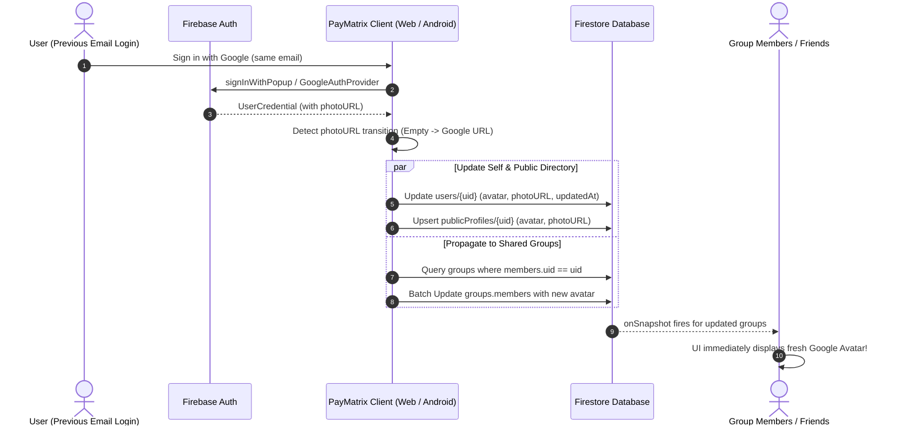

# Specification: Email-to-Google Auth Transition & Universal Avatar Propagation

> **Status:** Approved Requirement for Incremental 2.2.0 Enhancement  
> **Scope:** Firebase Authentication (Web & Native Android), Firestore Denormalized Collections (`users`, `publicProfiles`, `groups`, `friends`)  
> **Target:** Seamlessly propagate Google profile avatars across all shared spaces when a user transitions from Email login to Google login.

---

## 1. Problem Statement & User Journey

### The Problem
1. **Initial Sign-up:** A user registers on PayMatrix using standard **Email/Password** authentication. At this point, `firebaseUser.photoURL` is `null` or empty.
2. **Denormalization:** As the user creates groups, joins groups, and connects with friends, PayMatrix embeds their profile data (`{ uid, name, email, avatar: "" }`) into:
   - `groups/{groupId}.members` array
   - Reciprocal friend documents / friend arrays
   - `publicProfiles/{uid}`
3. **Subsequent Google Sign-In:** Later, the user logs in using **Google Sign-In** with the same email. Firebase Auth automatically links or authenticates the Google provider, providing a high-res profile photo (`firebaseUser.photoURL` from `googleusercontent.com`).
4. **The Defect:** Currently, only the user's local auth state and direct `users/{uid}` document may receive the new photo. Existing group members, friend cards, and activity logs continue to show the old blank/initial avatar because the denormalized embedded profiles in `groups` and `publicProfiles` were never updated for everyone else.

---

## 2. Requirement Specification

> **Core Requirement:**  
> If someone previously signed in with email, but then signs in via Google, and has an avatar on their Google account, PayMatrix **must automatically update that avatar for everyone** across all groups, friends, and public profiles.

### Technical Guarantees:
- **Zero Financial Disruption:** Avatar propagation touches strictly presentation metadata; it must never mutate integer expense balances, splits, or settlement states.
- **Universal Visibility:** Group members, friend lists, and admin views must see the new Google avatar without needing to re-add the user to the group.
- **Custom Upload Preservation:** If the user has explicitly uploaded a custom avatar inside PayMatrix, the app should respect their explicit custom avatar and not overwrite it unless the previous avatar was empty/placeholder.

---

## 3. Architecture & Data Flow



---

## 4. Implementation Blueprint for Existing 2.2.0

### Step 1: Detect Google Avatar Upgrade in `authService.js` (Web) & `AuthRepository.kt` (Android)

When synchronizing profile after login:
```javascript
// frontend/src/services/authService.js
export async function syncUserProfile(firebaseUser, preferredName = '') {
  await firebaseUser.getIdToken(true);
  const userDocRef = doc(db, 'users', firebaseUser.uid);
  const userDoc = await getDoc(userDocRef);
  const existingData = userDoc.exists() ? serializeFirestoreData(userDoc.data()) : null;

  const currentStoredAvatar = existingData?.avatar || existingData?.photoURL || '';
  const incomingGoogleAvatar = firebaseUser.photoURL || '';

  // Detect transition from empty/placeholder avatar to fresh Google avatar
  const shouldPropagateAvatar = Boolean(
    incomingGoogleAvatar && 
    (!currentStoredAvatar || currentStoredAvatar.includes('default-avatar') || existingData?.avatarSource === 'google')
  );

  const updates = {
    updatedAt: new Date().toISOString(),
    photoURL: incomingGoogleAvatar || currentStoredAvatar,
    avatar: incomingGoogleAvatar || currentStoredAvatar,
    avatarSource: incomingGoogleAvatar ? 'google' : (existingData?.avatarSource || 'none')
  };

  // 1. Update user document
  await setDoc(userDocRef, updates, { merge: true });

  // 2. Update public profile
  const publicProfileRef = doc(db, 'publicProfiles', firebaseUser.uid);
  await setDoc(publicProfileRef, {
    uid: firebaseUser.uid,
    name: resolvedName,
    displayName: resolvedName,
    avatar: updates.avatar,
    photoURL: updates.photoURL,
    updatedAt: updates.updatedAt
  }, { merge: true });

  // 3. If avatar changed, cascade update to all groups
  if (shouldPropagateAvatar && incomingGoogleAvatar !== currentStoredAvatar) {
    await propagateAvatarToGroupsAndFriends(firebaseUser.uid, incomingGoogleAvatar);
  }
}
```

### Step 2: Cascade Update Function (`propagateAvatarToGroupsAndFriends`)

```javascript
// frontend/src/services/userService.js or authService.js
export async function propagateAvatarToGroupsAndFriends(userId, newAvatarUrl) {
  if (!userId || !newAvatarUrl) return;

  try {
    // 1. Find all groups where the user is a member
    const groupsQuery = query(
      collection(db, 'groups'),
      where('memberUids', 'array-contains', userId)
    );
    const groupsSnapshot = await getDocs(groupsQuery);

    if (!groupsSnapshot.empty) {
      const batch = writeBatch(db);

      groupsSnapshot.docs.forEach((groupDoc) => {
        const groupData = groupDoc.data();
        let modified = false;

        const updatedMembers = (groupData.members || []).map((m) => {
          const mUid = m.uid || m._id || (typeof m === 'string' ? m : null);
          if (mUid === userId && (m.avatar !== newAvatarUrl || m.photoURL !== newAvatarUrl)) {
            modified = true;
            return {
              ...m,
              avatar: newAvatarUrl,
              photoURL: newAvatarUrl,
              updatedAt: new Date().toISOString()
            };
          }
          return m;
        });

        if (modified) {
          batch.update(groupDoc.ref, {
            members: updatedMembers,
            updatedAt: new Date().toISOString()
          });
        }
      });

      await batch.commit();
      console.info(`[AuthSync] Propagated new Google avatar across ${groupsSnapshot.size} groups for user ${userId}`);
    }
  } catch (error) {
    console.warn('[AuthSync] Avatar cascade skipped or partially failed:', error);
  }
}
```

### Step 3: Native Android Implementation (`AuthRepository.kt`)

In Android Kotlin, perform the same check in `syncUserProfile`:
```kotlin
// native-android/app/src/main/java/com/paymatrix/app/data/AuthRepository.kt
val googlePhotoUrl = firebaseUser.photoUrl?.toString()
val existingAvatar = userDoc.getString("avatar")

if (!googlePhotoUrl.isNullOrBlank() && (existingAvatar.isNullOrBlank() || existingAvatar != googlePhotoUrl)) {
    // 1. Update users/{uid}
    userRef.update(mapOf(
        "avatar" to googlePhotoUrl,
        "photoURL" to googlePhotoUrl,
        "avatarSource" to "google",
        "updatedAt" to Timestamp.now()
    )).await()

    // 2. Update publicProfiles/{uid}
    db.collection("publicProfiles").document(uid).set(mapOf(
        "uid" to uid,
        "name" to resolvedName,
        "avatar" to googlePhotoUrl,
        "photoURL" to googlePhotoUrl
    ), SetOptions.merge()).await()

    // 3. Cascade update user's groups
    propagateAvatarAcrossGroups(uid, googlePhotoUrl)
}
```

---

## 5. Test & Verification Checklist

- [ ] **Email Sign-Up First:** Create account via Email/Password -> verify avatar is blank or default letter circle.
- [ ] **Group Creation:** Create or join a group with 2+ members -> verify member avatar in group ledger shows placeholder.
- [ ] **Google Sign-In Upgrade:** Log out, sign back in using Google with the same email.
- [ ] **Group Ledger Real-Time Update:** Open the group on another member's device -> verify the member's card and avatar circle automatically displays the new Google photo without a manual reload.
- [ ] **Public Directory Check:** Fetch `/publicProfiles/{uid}` -> verify `avatar` matches the Google photo URL.
