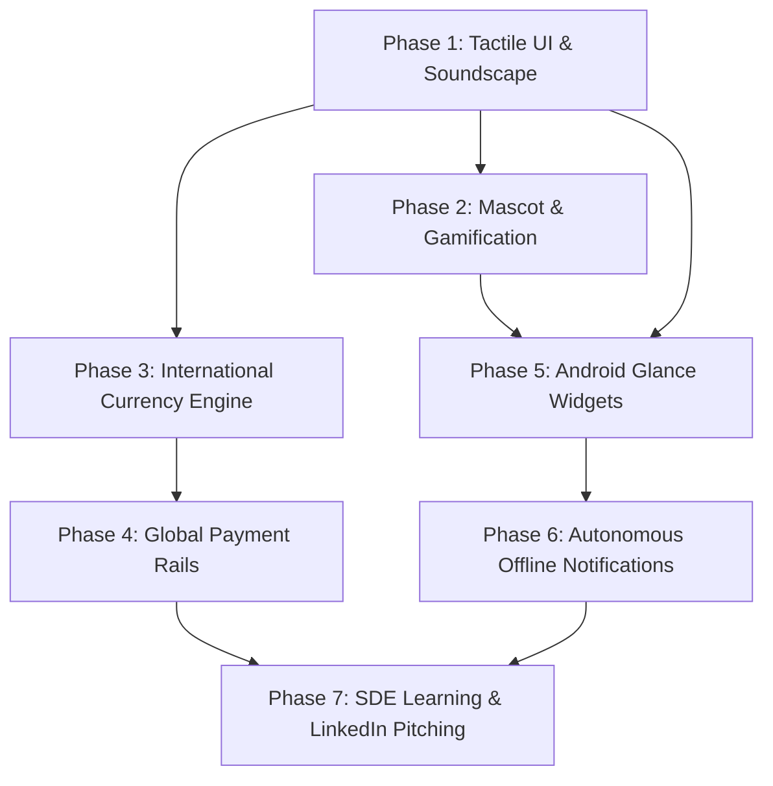

# PayMatrix v3.0 — Next Flagship Launch Master Directory

> **Sandboxed Staging Directory:** Isolated from running v2.2.0 production  
> **Production Protection Guarantee:** Zero mutation to Firebase Firestore collections, security rules, or Auth users.  
> **Target Release Identity:** `paymatrix` | `com.paymatrix.app` | Version `3.0.0` (`30000`)

---

## 1. Directory Structure & Phase Roadmap

This directory breaks down the complete **PayMatrix v3.0** overhaul into 7 focused, modular phases. Each phase is isolated to one engineering domain, preventing scope sprawl and allowing step-by-step implementation, testing, and 3-month mastery.

```
next flagship launch/
├── README.md                                # This Master Document
├── phase-1-tactile-ui-and-soundscape/       # 3D Push-Down Buttons, Springs, Web Audio & Haptics
│   ├── SPECIFICATION.md                     # Deep technical spec, physics constants, latency profiles
│   ├── web-tactile-system.md                # Tailwind 3D classes, Framer Motion spring presets, Web Audio sprite
│   └── android-tactile-system.md            # Jetpack Compose bouncy modifiers, SoundPool, VibratorManager
├── phase-2-mascot-and-gamification/         # "Milo the Mint" Mascot, Streaks, Karma XP & Financial Wrapped
│   ├── SPECIFICATION.md                     # Gamification state machine, streak persistence, badge criteria
│   ├── mascot-design-system.md              # Milo SVG vector states (Party, Snooze, Nudge, Detective)
│   └── financial-wrapped-engine.md          # 9:16 mobile story cards, HTML5 canvas export for Instagram/LinkedIn
├── phase-3-international-currency-engine/   # ISO 4217 Subunit Math, Multi-Currency Ledgers, Offline FX
│   ├── SPECIFICATION.md                     # Subunit precision mapping (0, 2, 3 decimals), Hare-Niemeyer proof
│   ├── web-currency-engine.md               # JavaScript/TypeScript BigInt/Integer engine & Intl formatters
│   └── android-currency-engine.md           # Kotlin Money object generalized to arbitrary minor units
├── phase-4-global-payment-rails/            # EPC SEPA QR (Europe), Pix (Brazil), US Deep Links, Cash
│   ├── SPECIFICATION.md                     # Rail detection matrix, deep link URI schemes, QR encoding payloads
│   ├── epc-sepa-qr-spec.md                  # European Payments Council QR specification & payload generator
│   └── pix-and-global-rails.md              # Brazil Pix payload, PayPal/Venmo/CashApp intents, Cash audit event
├── phase-5-android-glance-widgets/          # Jetpack Compose Glance Home Screen Widgets
│   ├── SPECIFICATION.md                     # Glance layout constraints, DataStore state management, update cycles
│   ├── balance-widget-blueprint.md          # 4x2 Balance & 1-tap Settle Glance widget code & previews
│   └── quick-action-widget-blueprint.md     # 4x1 Quick Expense & Camera Scan action bar widget
├── phase-6-autonomous-offline-notifications/# 100% On-Device WorkManager & AlarmManager Engine
│   ├── SPECIFICATION.md                     # Background worker constraints, battery optimization, channel architecture
│   ├── workmanager-nudge-engine.md          # PeriodicWorkRequest setup, local debt evaluation, notification dispatch
│   └── exact-alarm-streak-saver.md          # AlarmManager exact 8 PM streak reminder without server connection
├── phase-7-learning-and-pitching-playbook/  # 3-Month Curriculum, Weekly Exercises, LinkedIn Launch Campaign
│   ├── 12-week-learning-syllabus.md         # Day-by-day technical study schedule for SDE interview prep
│   └── linkedin-and-portfolio-kit.md        # Post copy, video recording storyboard, carousel slide templates
├── UI_FLAGSHIP_ARCHITECTURE_PLAN.md         # Full Mobile & Web Redesign Architecture Blueprint
└── AUTH_AVATAR_SYNC_SPECIFICATION.md        # Email-to-Google Sign-In Transition & Universal Avatar Propagation
```

---

## 2. Phase Execution Order & Milestones



| Phase | Core Objective | Primary Technology Stack | Primary Learning Outcome |
| :--- | :--- | :--- | :--- |
| **Phase 1** | Tactile feel, physical 3D buttons, bouncy springs, sounds & haptics | Framer Motion, Web Audio API, Compose Modifiers, SoundPool | Sensory UI physics & zero-latency audio |
| **Phase 2** | Emotional brand connection, streaks, badges, Financial Wrapped | SVG/Canvas, State Machines, Web Share API | Behavioral psychology & gamified viral retention |
| **Phase 3** | ISO 4217 arbitrary subunit arithmetic, offline FX, multi-currency graphs | JavaScript BigInt, Kotlin Long, Largest-Remainder Math | Floating-point drift prevention & financial precision |
| **Phase 4** | Global settlement rails (EPC SEPA QR, Pix, PayPal, Cash) | ZXing QR Encoders, RFC Intent Dispatchers | International banking standards & payment protocols |
| **Phase 5** | Glanceable home screen widgets for instant balance & scanning | Android Jetpack Glance, AppWidgetManager, DataStore | Modern declarative Android widget architecture |
| **Phase 6** | Autonomous offline notifications without cloud compute or FCM | Android WorkManager, AlarmManager, NotificationManagerCompat | Background process management & battery optimization |
| **Phase 7** | Full-stack SDE mastery, portfolio packaging, viral LinkedIn launch | System Design, Architectural Storytelling, Video Demos | Executive technical communication & hiring positioning |

---

## 3. Production Safety Rules
1. **Never mutate production Firestore:** All tests and prototypes run with local mocks or SQLite/IndexedDB.
2. **Preserve release identity:** Android namespace `com.paymatrix.app` and app name `paymatrix` (lowercase) must remain unaltered.
3. **Preserve settlement boundary:** Payment links only launch provider apps; debt is only settled upon explicit user confirmation.
