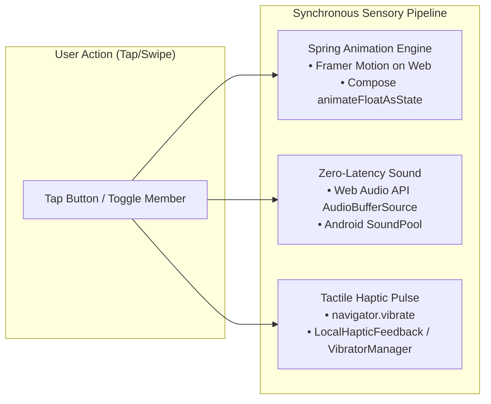

# Phase 1: Tactile UI, Physical Interaction & Soundscape Specification

> **Module Focus:** Sensory tactile feel, spring physics, auditory feedback, and micro-interactions  
> **Platform Parity:** React 19 (Web PWA) & Kotlin Jetpack Compose (Native Android)  
> **Target Latency:** Audio trigger < 15ms | Spring settlement < 250ms | 0 FPS frame drops

---

## 1. Executive Concept & Sensory Physics

Standard fintech interfaces feel like spreadsheets: flat buttons, static text, silent actions. When a user spends or settles money, there is no emotional feedback loop.

Phase 1 rebuilds PayMatrix's tactile language on three sensory dimensions:
1. **Physical Depth (Vision):** Buttons are chunky, 3D beveled mechanical objects with a physical 6px drop border that compresses downward by 4px on tap (`active:translate-y-1`), giving immediate tactile confirmation.
2. **Kinetic Response (Touch):** Screens and modal sheets do not use linear easing. They behave with **Hooke's Law spring physics** ($F = -kx - cv$), overshooting slightly before settling cleanly into resting state.
3. **Auditory & Vibrational Feedback (Sound & Haptics):**
   - Every participant toggle triggers a pleasant, wooden/bubble `pop`.
   - Every expense logged rings with a crisp metallic `coin drop`.
   - Completing a settlement triggers a triumphant `chime fanfare` accompanied by a synchronized double haptic pulse (`15ms -> 30ms`).

---

## 2. Technical Requirements & Physics Constants

### 2.1 Spring Physics Parameters
To achieve parity between the Web (Framer Motion) and Android (Jetpack Compose), use the following normalized physical constants:

| Spring Preset | Mass ($m$) | Stiffness ($k$) | Damping ($c$) | Android Damping Ratio | Web Equivalent | Use Case |
| :--- | :--- | :--- | :--- | :--- | :--- | :--- |
| **Tactile Bounce** | 0.8 | 450 | 22 | `DampingRatioMediumBouncy` | `stiffness: 450, damping: 22` | Button presses, toggle switches |
| **Fluid Sheet** | 1.0 | 300 | 28 | `DampingRatioLowBouncy` | `stiffness: 300, damping: 28` | Bottom sheets, drawer modals |
| **Number Ticker** | 0.5 | 600 | 35 | `DampingRatioNoBouncy` | `stiffness: 600, damping: 35` | Rolling balance counter odometer |

### 2.2 Auditory Sprite Matrix (Zero-Latency Audio)
Audio must be loaded via memory buffers (Web Audio API `AudioBuffer` and Android `SoundPool`) to eliminate HTTP request latency or decoder lag:

| Sound ID | Frequency / Pitch | Duration | Tone Character | Action Trigger |
| :--- | :--- | :--- | :--- | :--- |
| `fx_pop` | 520 Hz -> 780 Hz chirp | 60ms | Clean bubble pop | Toggle member in split list |
| `fx_coin` | 1480 Hz + 2960 Hz harmonics | 180ms | Crisp metallic ring | Expense successfully created |
| `fx_whoosh`| 200 Hz low-pass sweep | 120ms | Smooth air puff | Tab navigation / card flip |
| `fx_fanfare`| C-Major triad (C5-E5-G5-C6)| 450ms | Triumphant brass/harp chime | Settlement confirmed |
| `fx_delete` | 240 Hz -> 110 Hz pitch-down | 90ms | Subtle cardboard crumple | Expense deleted or cleared |

---

## 3. Platform Architecture

---

## 4. Testing & Acceptance Criteria
1. **Audio Latency:** Sound starts within 15ms of touch down (no audible delay between finger tap and sound).
2. **Mute Control:** Audio engine respects system silent mode and provides an in-app global toggle stored in local preferences.
3. **Accessibility:** Respects `prefers-reduced-motion` on Web and `Settings.Global.TRANSITION_ANIMATION_SCALE == 0` on Android by falling back to immediate transitions.
