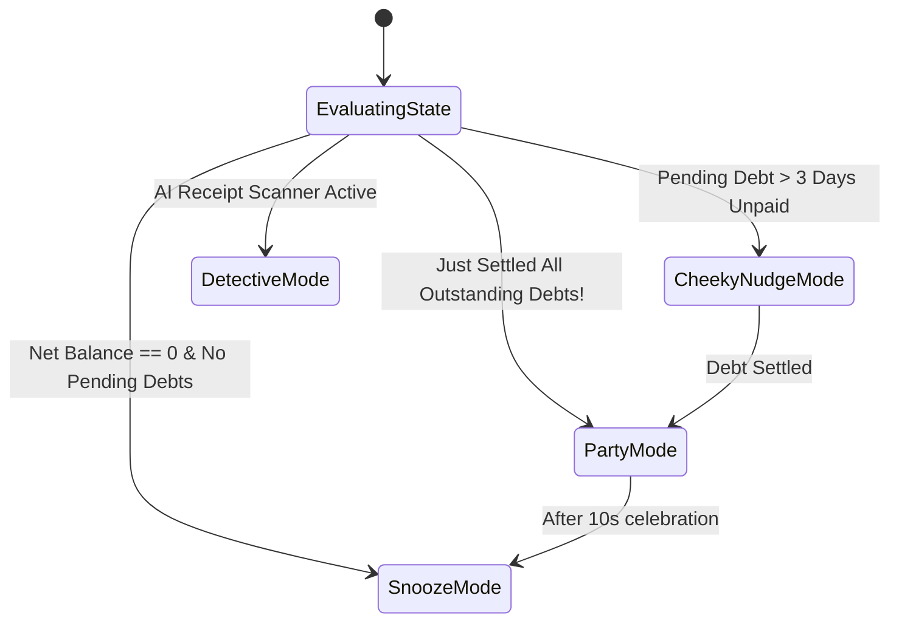

# Phase 2: Mascot, Gamification & Financial Wrapped Specification

> **Module Focus:** Behavioral habit loops, emotional brand engagement, mascot states, and viral shareability  
> **Key Personas:** "Milo the Mint" mascot, Zero-Debt Streaks, Karma XP, Spotify Wrapped-style story recap  
> **Inspiration:** Duolingo's streak psychology & Spotify Wrapped virality

---

## 1. Executive Concept: Emotional Gamification

People procrastinate settling debts because money conversations cause friction. Duolingo solved language learning drop-off by transforming a chore into a game: a persistent mascot, visual streak flames, and celebratory milestones.

**PayMatrix v3 Gamification System:**
1. **The Mascot ("Milo the Mint"):** A cheerful, coin-shaped financial guardian whose expression mirrors the user's financial standing.
2. **Zero-Debt Streaks:** A daily counter that increases every day the user maintains $0 overdue debts or settles debts within 24 hours of notification.
3. **Karma XP & Badges:** Points earned for positive financial habits (splitting evenly, prompt settlements, scanning receipts with AI).
4. **Trip Financial Wrapped:** An auto-generated, animated 9:16 mobile story card summarizing group spending, MVPs, and transactions saved, ready for 1-tap export to social media.

---

## 2. Mascot State Machine ("Milo the Mint")

Milo has 4 distinct behavioral states driven by the user's local balance and pending actions:



### State Specifications:
1. **`SnoozeMode` (Peaceful Rest):**
   - *Condition:* Net balance is 0.00 and no members owe the user.
   - *Visual:* Milo is sleeping on a cloud, with small floating `z` particles.
   - *Copy:* *"All clear! No debts, no worries."*
2. **`PartyMode` (Celebratory Euphoria):**
   - *Condition:* User confirms the final outstanding settlement.
   - *Visual:* Milo wears neon sunglasses, spins in a 360° backflip, and shoots confetti cannons.
   - *Copy:* *"Zero Debts! You are officially 100% settled up!"*
3. **`CheekyNudgeMode` (Playful Urgency):**
   - *Condition:* Someone has owed money for more than 72 hours.
   - *Visual:* Milo holds a megaphone or an itemized receipt with an impatient tap of his foot.
   - *Copy:* *"Alex owes you €15 from 4 days ago. Send a quick nudge?"*
4. **`DetectiveMode` (AI OCR Processing):**
   - *Condition:* User uploads a receipt to the Gemini scanner.
   - *Visual:* Milo wears a detective trench coat and monocle, with animated neon scanning lines sweeping across the receipt.
   - *Copy:* *"Scanning line items & calculating tax split..."*

---

## 3. Zero-Debt Streaks & Persistence Logic

### 3.1 Streak Rules
- A user starts at Streak `0`.
- Each day where:
  1. The user has zero overdue debts (> 24 hours old), **OR**
  2. The user logs a new shared expense or settles an open debt,
  The streak increments by `+1`.
- If an open debt remains unpaid past its 48-hour grace window, the streak freezes or drops to 0 unless a *"Streak Freeze"* token is active.

### 3.2 Offline Local Storage Schema
To prevent Firebase writes, streak metadata is persisted locally on device (in `localStorage` on Web and `DataStore Preferences` on Android):

```json
{
  "streakCount": 14,
  "lastActiveDate": "2026-09-05",
  "streakFreezeAvailable": 1,
  "karmaXp": 420,
  "unlockedBadges": ["SPEEDY_SETTLER", "FAIR_SHARE_50", "ITEMIZER_ELITE"]
}
```

---

## 4. Trip Financial Wrapped Engine

When a group finishes a trip or archives a ledger, PayMatrix v3 generates a **multi-slide visual story**:

| Slide | Title | Key Metrics Highlighted |
| :--- | :--- | :--- |
| **Slide 1** | The Total Damage | Total spent across the trip (e.g. `€2,450`), converted to group currency. |
| **Slide 2** | The Upfront Hero (MVP) | Member who paid the largest single share of upfront expenses. |
| **Slide 3** | The Debt Simplifier | Number of payments saved (e.g. *"Instead of 28 messy payments, PayMatrix simplified this to just 4 transfers"*). |
| **Slide 4** | The Speed Demon | Member who settled their balance the fastest. |
| **Slide 5** | The Final Scoreboard | All members at €0.00 with celebratory Milo graphic. |

**Export Formats:**
- 9:16 PNG/JPEG rendered on HTML5 Canvas (1080x1920px) optimized for Instagram Stories and WhatsApp Status.
- Native Android `Intent.ACTION_SEND` with direct image URI attachment.
