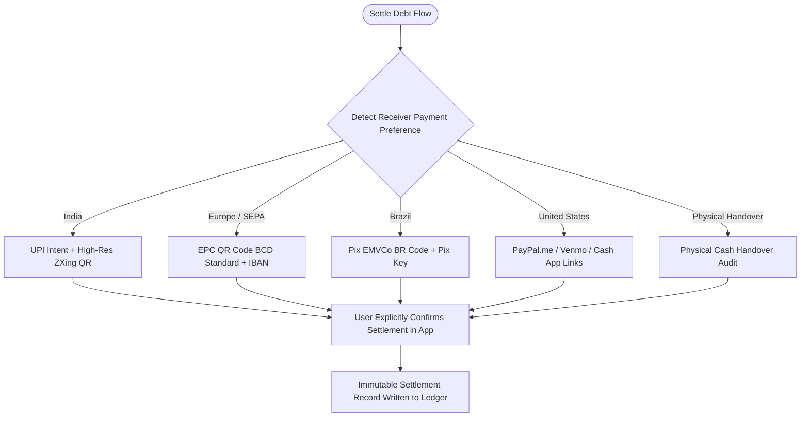

# Phase 4: Global Payment Settlement Rails Specification

> **Module Focus:** Cross-border payment dispatch, regional QR code standards, and deep-link protocol handlers  
> **Supported Rails:** UPI (India), EPC SEPA QR (European Union), Pix (Brazil), PayPal / Venmo / Cash App (US & Global), Physical Cash  
> **Safety Invariant:** External payment intents only launch provider apps; debt is strictly settled upon mutual confirmation

---

## 1. The Global Settlement Matrix

A critical barrier to international adoption is payment fragmentation. Different regions use completely different payment systems:

---

## 2. Technical Requirements by Rail

### 2.1 European Payments Council (EPC) QR Standard
- **Standard:** EPC069-12 / Quick Response Code Guidelines for SEPA Credit Transfers.
- **Payload Format:** Fixed multi-line ASCII string (`BCD\n002\n...`).
- **Compatibility:** Scanned natively by Deutsche Bank, Sparkasse, ING, BNP Paribas, ABN AMRO, Revolut, etc.

### 2.2 Brazil Central Bank Pix QR
- **Standard:** EMVCo Merchant-Presented QR Specification adopted by Banco Central do Brasil (BCB).
- **Payload:** Type-Length-Value (TLV) encoded string including GUI (`br.gov.bcb.pix`), merchant key, transaction amount, and CRC16 checksum.

### 2.3 US & International Deep Links
- **PayPal:** `https://paypal.me/{handle}/{amount}{currency}`
- **Venmo:** `venmo://paycharge?txn=pay&recipients={handle}&amount={amount}&note={note}`
- **Cash App:** `https://cash.app/${cashtag}/{amount}`

### 2.4 Physical Cash Settlement
- A single-tap *"Mark Paid via Cash"* action.
- Creates an audit event recording `paymentMethod: "CASH"`, `verifiedBy: userId`, `notes: "Physical cash handed over"`.
