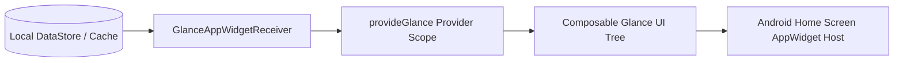

# Phase 5: Jetpack Compose Glance Android Widgets Specification

> **Module Focus:** Declarative Android home screen widgets powered by Jetpack Compose Glance  
> **Key Libraries:** `androidx.glance:glance-appwidget:1.1.1`, `androidx.glance:glance-material3:1.1.1`  
> **Target Sizes:** 4x2 Balance Card & 4x1 Quick Action Bar

---

## 1. Modern Android Widget Architecture

Before Jetpack Glance, Android widgets required archaic `RemoteViews`, XML layouts, and cumbersome broadcast receivers.
**Jetpack Compose Glance** introduces:
1. **Declarative Compose UI:** Composable widgets styled using familiar Compose concepts (`Column`, `Row`, `Text`, `Button`, `GlanceModifier`).
2. **Event-Driven Reactive State:** Widgets update only when the local database mutations complete, rather than wasting battery polling.
3. **GlanceTheme Integration:** Automatically responds to Android 12+ Material You Dynamic Theming and Day/Night system settings.

---

## 2. Widget Suite Breakdown

### 2.1 "Quick Net Balance & Settle" (4x2 / 3x2 Size)
- **Top Bar:** App branding (`paymatrix`) + Streak counter (`🔥 14 days`).
- **Net Balance Display:** Large bold header displaying current net balance (`+$142.50` in emerald or `-$35.00` in coral).
- **Pending Debt Snapshot:** Names and amounts of top 2 pending counterparties.
- **Action Buttons:** `[+ Add]` and `[Scan]` triggering direct Compose navigation deep links.

### 2.2 "Quick Action Strip" (4x1 Compact Size)
- A horizontal launcher strip providing 1-tap direct shortcuts:
  - ➕ **Add Shared Expense** (`paymatrix://expense/new`)
  - 📸 **AI Receipt Scanner** (`paymatrix://scanner`)
  - ⚡ **Settle Up Hub** (`paymatrix://settle`)
