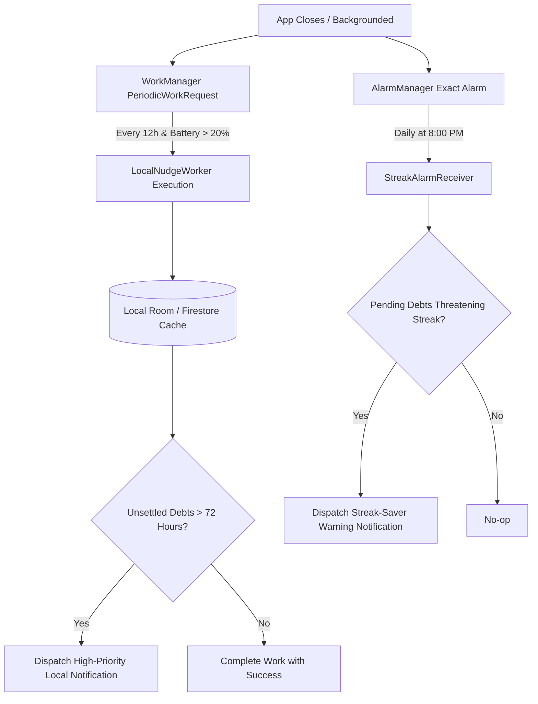

# Phase 6: Autonomous Offline Notification Engine Specification

> **Module Focus:** 100% on-device local notifications generated natively without network connection or cloud servers  
> **Key Android Components:** `androidx.work:work-runtime-ktx:2.10.0`, `android.app.AlarmManager`, `androidx.core.app.NotificationManagerCompat`  
> **Production Protection:** Eliminates the need for paid cloud push servers and consumes 0 Firebase Spark quota

---

## 1. Technical Architecture: Local vs Cloud Push

| Dimension | Cloud Push (FCM / APNs) | Autonomous Offline Engine (PayMatrix v3) |
| :--- | :--- | :--- |
| **Server Requirement** | Continuous cloud server or Cloud Functions | **Zero** server infrastructure |
| **Network Requirement**| Active Internet / Wi-Fi connection | **Zero network (Works in Airplane Mode)** |
| **Firebase Quota Cost** | Burns Cloud Functions invocations & DB reads | **Zero Firebase quota consumption** |
| **Reliability** | Fails if user is traveling without roaming | **100% reliable on-device execution** |
| **Battery Impact** | Negligible | Highly optimized via Android WorkManager Doze awareness |

---

## 2. Notification Channels Architecture (Android 8.0+)

1. **`paymatrix_nudges` (Settlement Reminders):**
   - Importance: `IMPORTANCE_DEFAULT`
   - Sound: System default notification sound
   - Vibration: Standard gentle pulse
   - Description: Reminders for shared group debts older than 3 days
2. **`paymatrix_streaks` (Streak Protection):**
   - Importance: `IMPORTANCE_HIGH`
   - Sound: Celebratory chime
   - Vibration: Urgent double-pulse
   - Description: Daily streak protection alerts
