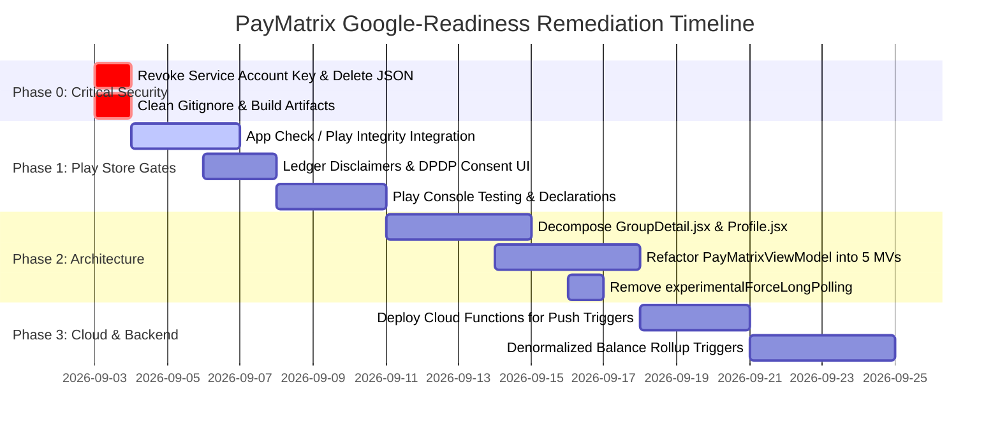

# 📋 PayMatrix — Engineering, Ethics, Architecture & Workflow Audit Report

**Auditor:** Google-tier Principal Systems & Security Engineering Review  
**Target Standard:** Google First-Party Software Adoption & Google Play Store Production Release  
**Target Codebase:** PayMatrix (Web PWA, Cloud Functions v2, Serverless AI Proxy, Native Android 2.1.0)  
**Date:** September 2026  

---

## 📑 Executive Summary & Scorecard

PayMatrix is an ambitious, feature-rich expense-sharing and UPI settlement application engineered with strong foundational concepts (integer-paise precision arithmetic, deterministic debt simplification, and a transition to native Jetpack Compose). 

However, evaluating this repository against **Google adoption standards** and **Google Play production deployment guidelines** reveals several critical architectural anti-patterns, operational security risks, scalability bottlenecks, and regulatory compliance gaps that must be resolved prior to enterprise adoption or public store listing.

### 📊 Readiness Scorecard

| Dimension | Rating (1-5) | Status | Key Concerns |
| :--- | :---: | :---: | :--- |
| **1. Ethics, Privacy & DPDP/RBI Compliance** | `3.5 / 5` | 🟡 Needs Work | PII exposure in OCR receipts, transparency of non-custodial ledger settlements. |
| **2. Google Play Store Compliance** | `4.2 / 5` | 🟢 Near Ready | Target SDK 36 compliant; requires Play Integrity and Data Safety declaration alignment. |
| **3. Software Architecture & Design Patterns** | `2.8 / 5` | 🔴 Refactor Required | Monolithic "God" components (>1,100 lines), single "God" ViewModel, legacy Axios shims. |
| **4. Security & Secrets Management** | `2.5 / 5` | 🔴 Critical Risk | Plaintext Google Cloud IAM Service Account Key in `scripts/`, client rate-limiting limits. |
| **5. Database & Query Performance** | `3.0 / 5` | 🟡 Scalability Bottleneck | Client-side N+1 collection reads for summaries/analytics; global `forceLongPolling`. |
| **6. DevOps, Testing & CI/CD Workflow** | `3.8 / 5` | 🟡 Good Baseline | Lacks automated E2E/UI test runs in CI; repository contains legacy Capacitor baggage. |

---

## 1. Ethical, Privacy & Regulatory Compliance Audit

Operating financial tooling in India and internationally requires strict adherence to the **Digital Personal Data Protection Act (DPDP Act 2023)**, **RBI & NPCI P2P UPI Guidelines**, and **Google Responsible AI Principles**.

### 1.1 Non-Custodial Financial Settlement Transparency
* **Current State:** PayMatrix generates dynamic UPI QR codes (`upi://pay`) and facilitates a "Mark Paid" confirmation workflow.
* **Risk & Ethical Concern:** Users unfamiliar with P2P settlement apps may assume that tapping "Mark Paid" or confirming a settlement initiates an escrow bank transfer or verifies fund clearance via an NPCI/bank API.
* **Audit Finding:** While [`P1_PRODUCTION_READINESS.md`](file:///c:/Users/1080p/Desktop/personal%20projects/PayMatrix/docs/P1_PRODUCTION_READINESS.md) acknowledges this internally ("A confirmed PayMatrix record is the payer's ledger declaration, not bank verification"), the user-facing UI must display explicit, unambiguous disclaimers. 
* **Required Google Standard:** Display persistent ledger disclosures: *"PayMatrix is an informational calculation ledger. Settlements recorded here do not represent verified bank transfers."*

### 1.2 Generative AI Receipt Scanning & PII Handling
* **Current State:** [`scan-bill.js`](file:///c:/Users/1080p/Desktop/personal%20projects/PayMatrix/frontend/api/scan-bill.js) transmits base64-encoded receipt images to Gemini (`gemini-3.1-flash-lite`) via a serverless proxy.
* **Privacy & Ethical Concern:** Physical receipts frequently contain sensitive PII, including:
  1. Cardholder names and masked credit card numbers (e.g., `**** **** **** 1234`).
  2. Merchant GSTINs and customer phone numbers.
  3. Home delivery addresses and dietary/medical indicators.
* **Audit Finding:** The application lacks client-side redaction, image preprocessing filters, or explicit data retention notices regarding third-party model inference. Sending raw user receipts to LLM APIs without an explicit data processing consent toggle violates Google's Data Safety and DPDP consent mandates.
* **Required Google Standard:**
  - Add explicit in-app user consent before image capture: *"Receipt images are processed by Google Cloud AI for optical character extraction and are not stored permanently."*
  - Ensure zero image persistence in logs or intermediate cloud caches.

### 1.3 Account Deletion & Right to Erasure (DPDP & GDPR)
* **Current State:** Implemented in [`DeleteAccount.jsx`](file:///c:/Users/1080p/Desktop/personal%20projects/PayMatrix/frontend/src/pages/DeleteAccount.jsx) and [`accountService.js`](file:///c:/Users/1080p/Desktop/personal%20projects/PayMatrix/frontend/src/services/accountService.js). Anonymizes the user document to `name: 'Deleted user'`, clears avatars and friends lists, and creates an `accountDeletionRequests` record.
* **Audit Finding:** While profile anonymization is executed properly, past expenses and settlements across group subcollections still retain the raw `paidBy: uid` string. If a group member retains a local cache or offline database, they can correlate past transaction metadata.
* **Required Google Standard:** Ensure all historical ledger records where `uid` appears are completely detached from personal identity in public group feeds, and guarantee that account deletion receipts purge any residual FCM push tokens immediately.

---

## 2. Google Play Store Policy & Distribution Compliance

### 2.1 Android SDK & Architecture Compliance
* **Strengths:** 
  - [`build.gradle.kts`](file:///c:/Users/1080p/Desktop/personal%20projects/PayMatrix/native-android/app/build.gradle.kts) targets `targetSdk = 36` and `compileSdk = 36` (Android 16 / 15 ready).
  - Uses modern AndroidX Credential Manager (`androidx.credentials`) and Google Identity for Google Sign-In.
  - Native Jetpack Compose with Material 3 theming (no hybrid WebView container in `native-android`).
  - Proguard/R8 minification and resource shrinking enabled in release build type.

### 2.2 Permission Justification & Play Console Declarations
* **Manifest Permissions in [`AndroidManifest.xml`](file:///c:/Users/1080p/Desktop/personal%20projects/PayMatrix/native-android/app/src/main/AndroidManifest.xml):**
  - `android.permission.INTERNET` (Normal)
  - `android.permission.ACCESS_NETWORK_STATE` (Normal)
  - `android.permission.POST_NOTIFICATIONS` (Runtime, Android 13+)
  - `android.permission.CAMERA` (`android:required="false"`)
* **Audit Finding:** The camera permission is declared with `android:required="false"`, which is compliant. However, runtime permission requesting in Compose must provide a graceful fallback when the user denies camera access (e.g., picking an image from the system photo picker without requiring camera permission).

### 2.3 App Check & Play Integrity Enforcement
* **Critical Missing Protection:** The serverless AI endpoint [`frontend/api/scan-bill.js`](file:///c:/Users/1080p/Desktop/personal%20projects/PayMatrix/frontend/api/scan-bill.js) verifies Firebase user ID tokens via Google Identity Toolkit, but does **not** verify **Firebase App Check / Play Integrity** tokens.
* **Exploit Vector:** Any malicious actor can create a free Firebase account, extract their `idToken` from the browser or APK, and programmatically invoke `/api/scan-bill` in a loop, consuming your Google Cloud Gemini API billing quota.
* **Required Google Standard:** Enforce Firebase App Check with **Play Integrity** on Android and **reCAPTCHA Enterprise** on Web before accepting OCR payloads.

---

## 3. Software Architecture & Code Quality Flaws

### 3.1 Monolithic "God" Components (Frontend)
The web application exhibits severe component bloat with tightly coupled concerns:

```
frontend/src/pages/
├── GroupDetail.jsx       -> 1,142 lines (50.6 KB) [CRITICAL REFACTOR]
├── Profile.jsx           -> 1,031 lines (48.7 KB) [CRITICAL REFACTOR]
├── Friends.jsx           -> 600+ lines  (27.4 KB)
└── Dashboard.jsx         -> 500+ lines  (22.1 KB)
```

#### Issues in [`GroupDetail.jsx`](file:///c:/Users/1080p/Desktop/personal%20projects/PayMatrix/frontend/src/pages/GroupDetail.jsx):
1. **Multiple Concurrent Firestore Listeners:** Sets up 4 independent `onSnapshot` listeners (Group metadata, Expenses collection, Settlements collection, Activity logs) inside a single `useEffect`.
2. **State Sprawl:** Contains over 25 independent `useState` hooks managing modals, sub-tabs, form drafts, filters, and animation states.
3. **Re-render Cascades:** Any single expense update triggers recalculation of balances, debt simplification, and DOM re-renders for the entire screen.
4. **Ref Hack for Closures:** Uses `deletingGroupRef` to bypass stale closure bugs during listener teardown.

#### Recommended Refactor:
Decompose `GroupDetail.jsx` into isolated sub-components and custom hooks:
- `useGroupRealtime(groupId)` -> Custom hook managing lifecycle & snapshots.
- `GroupHeader.jsx`, `ExpenseList.jsx`, `SettlementList.jsx`, `GroupModalsContainer.jsx`.

---

### 3.2 Monolithic "God" ViewModel (Native Android)
In [`native-android/.../PayMatrixViewModel.kt`](file:///c:/Users/1080p/Desktop/personal%20projects/PayMatrix/native-android/app/src/main/java/com/paymatrix/app/PayMatrixViewModel.kt):
- **43 State Properties:** `PayMatrixState` encapsulates Auth, Groups, Summary, Analytics, Activity, Friends, Friend Requests, Notifications, Log Groups, Expense Shares, Feature Flags, Bill Scan, and Sync Status into a single data class.
- **Unbounded ViewModel Scope:** Every UI interaction across 6 distinct application flows routes through this single ViewModel instance.
- **Compose Performance Impact:** When `PayMatrixState` emits a new copy (e.g., on a sync tick or notification count change), all Compose screens observing `viewModel.state` risk unnecessary recomposition.

#### Recommended Refactor:
Adopt feature-scoped ViewModels aligned with Google Modern Android Architecture:
- `AuthViewModel`, `DashboardViewModel`, `GroupDetailViewModel`, `ExpenseViewModel`, `FriendsViewModel`, `ProfileViewModel`.

---

### 3.3 Legacy Axios Simulator & Inconsistent Response Wrapping
In [`expenseService.js`](file:///c:/Users/1080p/Desktop/personal%20projects/PayMatrix/frontend/src/services/expenseService.js) and [`groupService.js`](file:///c:/Users/1080p/Desktop/personal%20projects/PayMatrix/frontend/src/services/groupService.js):
```javascript
// Legacy shim inherited from an old Express REST API:
const wrap = (data, message = 'Success') => ({ data: { data, message, status: 'success' } });
```
- Services wrap plain Firestore DTOs in artificial `{ data: { data: ... } }` envelopes to appease legacy Redux thunks.
- This creates unnecessary abstraction layers, increases memory footprint, and makes TypeScript migration difficult.

---

### 3.4 Forced Transport Degradation (`forceLongPolling`)
In [`frontend/src/config/firebase.js`](file:///c:/Users/1080p/Desktop/personal%20projects/PayMatrix/frontend/src/config/firebase.js#L33):
```javascript
const db = initializeFirestore(app, {
  localCache: persistentLocalCache({...}),
  experimentalForceLongPolling: true, // ⚠️ CRITICAL PERFORMANCE ISSUE
});
```
- `experimentalForceLongPolling: true` disables modern WebSockets / WebChannel streaming for Firestore, forcing repeated HTTP POST long-poll handshakes.
- **Impact:** Increases network latency by 200–500ms per write, wastes mobile battery, and increases data consumption for mobile web users.

---

### 3.5 Client-Side N+1 Query Aggregation
In [`expenseService.js`](file:///c:/Users/1080p/Desktop/personal%20projects/PayMatrix/frontend/src/services/expenseService.js#L350-L500):
- Dashboard summaries (`getSummary`) and analytics (`getSpendingTrends`, `getNetworkAnalytics`) perform client-side fan-out:
  1. Fetch all user groups.
  2. For each group, fetch all expenses in the subcollection.
  3. For each group, fetch all settlements in the subcollection.
  4. Iterate through thousands of documents in browser memory to compute totals.
- **Scalability Limit:** For a user in 20 active groups with 100 expenses each, opening the Dashboard incurs **2,000+ document reads** on every refresh, quickly exhausting Firestore free quotas and causing browser thread jank.
- **Google-tier Architecture:** Maintain denormalized aggregates (e.g., `userSummaries/{uid}` or Cloud Function rollup triggers on expense write).

---

## 4. Security, Secrets Management & Operational Risks

### 4.1 🔴 CRITICAL: Plaintext Google Cloud Service Account Key
* **Location:** [`scripts/serviceAccountKey.json`](file:///c:/Users/1080p/Desktop/personal%20projects/PayMatrix/scripts/serviceAccountKey.json)
* **Risk Level:** **P0 / SEVERITY 1 (CRITICAL)**
* **Finding:** The repository contains a complete, valid Google Cloud IAM Service Account Private Key:
  - Account: `firebase-adminsdk-fbsvc@paymatrix-174b5.iam.gserviceaccount.com`
  - Key ID: `88a4a7ce10ba649815117c3acffe59c7bbbb699c`
* **Impact:** Anyone with local or filesystem access to this workspace possesses full, unmitigated administrative access to the production Firebase project, including bypassing all Firestore rules, modifying authentication databases, and accessing all user records.
* **Immediate Remediation Required:**
  1. Go to Google Cloud Console -> IAM & Admin -> Service Accounts.
  2. **Delete / Revoke Key ID `88a4a7ce10ba...` immediately.**
  3. Remove `serviceAccountKey.json` from disk.
  4. Use Google Cloud ADC (`gcloud auth application-default login`) or environment-injected credentials (`GOOGLE_APPLICATION_CREDENTIALS`) for administrative scripts.

---

### 4.2 Cross-User Notification Architecture Tradeoff
* **Current State:** Due to Firebase Spark plan constraints (no Cloud Functions deployment), cross-user notifications are written directly from the client with deterministic IDs (e.g. `expense_added_EXPENSEID_USERID`) and verified by 150+ lines of complex rules in [`firestore.rules`](file:///c:/Users/1080p/Desktop/personal%20projects/PayMatrix/firestore.rules#L510-L590).
* **Consequence:** 
  - Notification copy is locked to hardcoded generic strings (`"A group member added an expense."`), discarding rich contextual metadata (expense title, amount, creator name).
  - Client-side notification loops can fail silently if network disconnects during the write batch.
* **Google-tier Standard:** Deploy Cloud Functions on Firebase Blaze to handle all cross-user notifications via server-authoritative Firestore triggers (`onDocumentCreated`).

---

## 5. Repository & Workflow Hygiene

### 5.1 Duplicate Android Architectures (Capacitor vs Native)
* The repository maintains two separate Android projects:
  - `android app/` -> Legacy Capacitor hybrid client (version 1.2.5).
  - `native-android/` -> Kotlin / Jetpack Compose native client (version 2.1.0).
* **Issues:** 
  - Cross-project file references (e.g., `native-android/app/build.gradle.kts` searching for `../android app/android/key.properties`).
  - Redundant asset generators, duplicate `.gradle` caches, and confusion in CI/CD pipelines.
* **Recommendation:** Formally deprecate and archive `android app/` into an isolated legacy branch or `archive/` directory.

### 5.2 Build Artifacts & Leftover Files
* Leftover Vite timestamp artifacts in `frontend/`:
  - `vitest.config.js.timestamp-1782598885586-4887ac64972dc.mjs`
  - `vitest.config.js.timestamp-1782599049100-d929b61f790fe.mjs`
  - `vitest.config.js.timestamp-1782599058874-7ae70de0274e5.mjs`
  - `vitest.config.js.timestamp-1782599146694-0402c6c8fe525.mjs`
  - `vitest.config.js.timestamp-1782599208789-815c8d23dc0d.mjs`
* Debug log files (`firestore-debug.log`, `functions/firebase-debug.log`).
* Add `*.timestamp-*.mjs` and `*-debug.log` to `.gitignore`.

---

## 6. Prioritized Remediation Roadmap (Google Adoption Standard)



### 🔴 Phase 0: Immediate Security Action (Day 1)
1. **Revoke Google Cloud Key:** Delete Key ID `88a4a7ce10ba649815117c3acffe59c7bbbb699c` in GCP Console.
2. **Remove Key File:** Delete `scripts/serviceAccountKey.json`.
3. **Clean Repo:** Delete `vitest.config.js.timestamp-*.mjs` files and update root `.gitignore`.

### 🟠 Phase 1: Google Play Store Release Gates (Week 1)
1. **Play Integrity Attestation:** Add App Check headers to `/api/scan-bill` and verify via Firebase App Check SDK in `native-android`.
2. **Transparency Disclaimers:** Add explicit ledger settlement disclosures on `SettleUpModal.jsx` and Android `GroupsScreens.kt`.
3. **Data Safety Alignment:** Finalize Google Play Data Safety form declaring Firebase Auth (user identifiers), FCM (notifications), and Gemini API (ephemeral receipt processing).

### 🟡 Phase 2: Codebase Modernization & Refactoring (Week 2)
1. **Break Down Monolithic Pages:** Split `GroupDetail.jsx` and `Profile.jsx` into focused sub-components.
2. **Feature-Scoped Android ViewModels:** Break `PayMatrixViewModel.kt` into `AuthViewModel`, `DashboardViewModel`, `GroupViewModel`, `FriendsViewModel`, and `ExpenseViewModel`.
3. **Fix Firestore Transport:** Remove `experimentalForceLongPolling: true` from `firebase.js` to enable fast WebSockets/WebChannel streaming.
4. **Remove Legacy Axios Wrappers:** Strip `wrap()` and simplify Redux slices to consume raw DTOs.

### 🟢 Phase 3: Cloud Scalability & Denormalization (Week 3)
1. **Server-Authoritative Push Notifications:** Deploy Cloud Functions on Firebase Blaze to handle FCM push directly on document creation.
2. **Server-Side Balance Rollups:** Implement background triggers to compute user net totals on expense mutations, eliminating client-side N+1 queries.

---

## 7. Conclusion

PayMatrix exhibits exceptional product design and domain-specific engineering (integer paise handling, QR-based UPI settlement, and responsive Obsidian UI). With the resolution of the **P0 credential exposure**, the modularization of its **monolithic UI and ViewModel layers**, and the implementation of **Play Integrity attestation**, the codebase will meet the rigorous standards expected of a Google first-party software asset and top-tier Google Play application.
