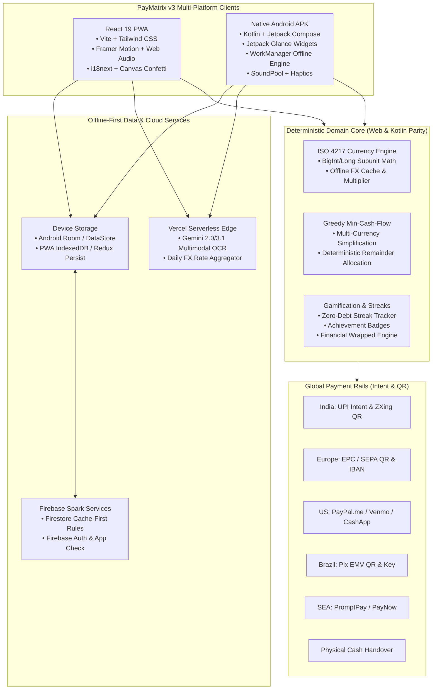
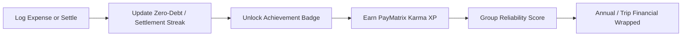
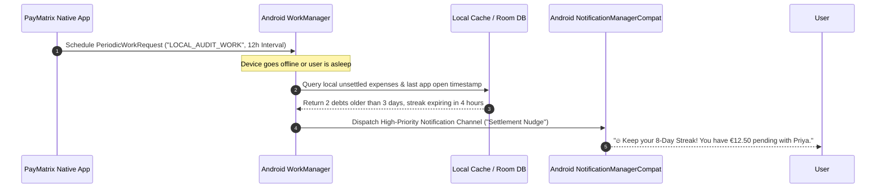

# PayMatrix v3.0 — The Global & Addictive Financial Engine
## Architectural Master Plan, Design System & 3-Month Engineering Blueprint

> **Document Status:** Official Version 3.0 Architectural Blueprint  
> **Target Release Identity:** `paymatrix` | `com.paymatrix.app` | Version `3.0.0` (`30000`)  
> **Scope:** Multi-Currency Ledger, Global Payment Rails, Duolingo-Inspired Gamified UX, Jetpack Glance Widgets, Offline Local Notifications, 3-Month Mastery Curriculum, and LinkedIn Pitching Playbook.

---

## Executive Vision: Why PayMatrix v3?

Shared expense apps have historically been utility-first, boring, and emotionally flat: a gray ledger of numbers that people only open when forced to settle a bill. Furthermore, existing solutions like Splitwise have alienated users with aggressive paywalls, 10-second wait timers, and regional limitations.

**PayMatrix v3.0** transforms expense splitting into a **vibrant, addictive, and globally inclusive experience**:
1. **Internationalized by Design:** Supports 160+ currencies with deterministic integer subunit math, offline-first FX rates, and native payment rails across North America, Europe, Latin America, Southeast Asia, and India.
2. **Duolingo-Level Tactile Delight:** Physical chunky 3D buttons, bouncy spring physics, playful soundscapes, tactile haptics, celebratory particle confetti, and a dynamic financial companion mascot (*"Milo the Mint"*).
3. **Glanceable Android Widgets:** Real-time home screen balance cards, 1-tap receipt scanning, and live trip group spending snapshots powered by Jetpack Compose Glance.
4. **100% Offline Local Notifications:** Smart on-device nudges, streak savers, and debt reminders running entirely via Android `WorkManager` without requiring server compute or burning Firebase free-tier quotas.
5. **Zero-Quota Firebase Architecture:** Preserving the 100% free Spark plan scaling model while offering instant, offline-first interactions.

---

## 1. System Architecture & High-Level Topology



---

## 2. Global Internationalization (i18n & Multi-Currency)

### 2.1 The ISO 4217 Subunit Engine (Preventing Floating-Point Drift)
In financial ledgers, **floating-point numbers (`0.1 + 0.2 === 0.30000000000000004`) are catastrophic**. PayMatrix v2 utilized integer *paise* (1/100 INR). PayMatrix v3 generalizes this into **Arbitrary Subunit Precision ($10^{\text{decimals}}$)**.

#### Subunit Hierarchy:
- **2 Decimals ($10^2 = 100$ Subunits):** USD, EUR, GBP, INR, CAD, AUD, SGD, CHF, BRL. (Stored as cents/pence/paise).
- **0 Decimals ($10^0 = 1$ Subunit):** JPY, KRW, VND, CLP, HUF. (Stored as whole units).
- **3 Decimals ($10^3 = 1000$ Subunits):** KWD, BHD, OMR, JOD, TND. (Stored as fils/millimes).

```typescript
// Shared Currency Specification Model
export interface CurrencyMeta {
  code: string;           // "USD", "EUR", "JPY", "INR", "KWD"
  symbol: string;         // "$", "€", "¥", "₹", "KD"
  decimals: number;       // 2, 0, 3
  subunitMultiplier: number; // 100, 1, 1000
  name: string;           // "US Dollar", "Japanese Yen"
  symbolPlacement: 'prefix' | 'suffix';
  flag: string;           // "🇺🇸", "🇯🇵", "🇮🇳"
}

export const CURRENCY_REGISTRY: Record<string, CurrencyMeta> = {
  USD: { code: 'USD', symbol: '$', decimals: 2, subunitMultiplier: 100, name: 'US Dollar', symbolPlacement: 'prefix', flag: '🇺🇸' },
  EUR: { code: 'EUR', symbol: '€', decimals: 2, subunitMultiplier: 100, name: 'Euro', symbolPlacement: 'prefix', flag: '🇪🇺' },
  GBP: { code: 'GBP', symbol: '£', decimals: 2, subunitMultiplier: 100, name: 'British Pound', symbolPlacement: 'prefix', flag: '🇬🇧' },
  INR: { code: 'INR', symbol: '₹', decimals: 2, subunitMultiplier: 100, name: 'Indian Rupee', symbolPlacement: 'prefix', flag: '🇮🇳' },
  JPY: { code: 'JPY', symbol: '¥', decimals: 0, subunitMultiplier: 1, name: 'Japanese Yen', symbolPlacement: 'prefix', flag: '🇯🇵' },
  KWD: { code: 'KWD', symbol: 'KD', decimals: 3, subunitMultiplier: 1000, name: 'Kuwaiti Dinar', symbolPlacement: 'prefix', flag: '🇰🇼' },
  BRL: { code: 'BRL', symbol: 'R$', decimals: 2, subunitMultiplier: 100, name: 'Brazilian Real', symbolPlacement: 'prefix', flag: '🇧🇷' }
};
```

### 2.2 Multi-Currency Group Math & Offline Exchange Rates
When users take an international trip (e.g., European travelers visiting Tokyo, or Indian friends traveling to Dubai):
1. **Group Base Currency:** The group sets a default accounting currency (e.g. `EUR`).
2. **Multi-Currency Transactions:** A user can record an expense in `JPY`.
3. **Immutable Exchange Rate Snapshot:** At the moment of creation, the transaction records:
   - `originalAmount`: Integer subunits of the expense currency (e.g., `¥15,000` = `15000` units).
   - `originalCurrency`: `"JPY"`
   - `exchangeRate`: Base/Foreign rate snapshot (e.g., `0.0062` EUR per JPY).
   - `baseAmountSubunits`: Deterministically converted integer subunits in group currency (`15000 * 0.0062 = €93.00` = `9300` cents).
4. **Offline FX Table:** The client bundles a fallback JSON FX table and refreshes it daily via a lightweight serverless endpoint (`/api/fx-rates`) that queries the European Central Bank (ECB) feed. If offline, the last cached rate is used with a visual badge: *"Offline rate applied"*.

### 2.3 Global Payment Settlement Rails (Beyond UPI)
> [!IMPORTANT]
> **The Golden Rule of PayMatrix Settlements:**  
> External payment deep-links or QR codes *only launch the payer's application*. They **never** automatically mark debts as paid. Settlements are recorded **strictly after** the user confirms payment in their own banking records.

| Region / Rail | Protocol / Scheme | Implementation Spec |
| :--- | :--- | :--- |
| **India (UPI)** | `upi://pay?pa={vpa}&pn={name}&am={amt}&cu=INR` | High-res ZXing QR + Native Intent Launch + Copy VPA |
| **Europe (SEPA / EPC QR)** | `BCD\n002\n1\nSCT\n...\n{IBAN}\nEUR{amt}` | European Payments Council QR format standard + IBAN copy |
| **United States & Global** | `https://paypal.me/{handle}/{amt}`<br>`venmo://paycharge?txn=pay&recipients={handle}&amount={amt}`<br>`https://cash.app/${cashtag}/{amt}` | Direct app deep-links with fallback web redirect |
| **United Kingdom** | `revolut.me/{tag}` / Wise P2P links | Instant peer-to-peer web and app links |
| **Brazil (Pix)** | Pix EMVCo BR Code Standard | Payload string generation + Pix Copy & Paste + Static QR |
| **Global Cash** | Manual Settlement Event | 1-Tap *"Paid via Physical Cash"* audit record |

### 2.4 Multilingual Architecture (Localization)
- **Web App:** `i18next` + `react-i18next` with language detection and lazy-loaded JSON namespaces (`en`, `es`, `de`, `fr`, `hi`, `ja`, `pt`, `ar`).
- **Android App:** Native Android `res/values-{locale}/strings.xml` with per-app language selection via `AppCompatDelegate.setApplicationLocales()` or Compose `Configuration.setLocale()`.
- **Bidirectional (RTL) Layouts:** Full support for Arabic (`ar`) and Hebrew (`he`) with mirrored flex directions in Tailwind (`rtl:space-x-reverse`) and Compose `LayoutDirection.Rtl`.

---

## 3. Duolingo-Level UI, Aesthetics & Gamification Design System

Duolingo's secret is **tactile physicality, micro-feedback, emotional stakes, and continuous celebration**. Financial apps fail because they make users feel anxious about money. PayMatrix v3 makes settling and organizing money feel like a rewarding game.

### 3.1 The Tactile Design System ("Chunky & Playful")

#### 1. 3D Beveled Buttons (The "Push-Down" Effect)
Buttons are physical objects with depth that physically compress when pressed down.

```css
/* Tailwind CSS 3D Button Utility */
.btn-3d-primary {
  @apply relative inline-flex items-center justify-center font-bold px-6 py-3 rounded-2xl
         bg-emerald-500 text-white shadow-[0_6px_0_0_#059669]
         active:translate-y-1.5 active:shadow-[0_0px_0_0_#059669]
         transition-all duration-75 select-none;
}
.btn-3d-secondary {
  @apply relative inline-flex items-center justify-center font-bold px-6 py-3 rounded-2xl
         bg-slate-800 text-white border-2 border-slate-700 shadow-[0_6px_0_0_#1e293b]
         active:translate-y-1.5 active:shadow-[0_0px_0_0_#1e293b]
         transition-all duration-75 select-none;
}
```

```kotlin
// Jetpack Compose Bouncy Press Modifier
@Composable
fun Modifier.bouncyClickable(onClick: () -> Unit): Modifier {
    var isPressed by remember { mutableStateOf(false) }
    val scale by animateFloatAsState(
        targetValue = if (isPressed) 0.94f else 1.0f,
        animationSpec = spring(
            dampingRatio = Spring.DampingRatioMediumBouncy,
            stiffness = Spring.StiffnessLow
        ),
        label = "BouncyPress"
    )
    val haptic = LocalHapticFeedback.current

    return this
        .graphicsLayer {
            scaleX = scale
            scaleY = scale
        }
        .pointerInput(Unit) {
            detectTapGestures(
                onPress = {
                    isPressed = true
                    haptic.performHapticFeedback(HapticFeedbackType.LongPress)
                    tryAwaitRelease()
                    isPressed = false
                },
                onTap = { onClick() }
            )
        }
}
```

#### 2. Soundscape & Haptic Design (Auditory & Tactile Euphoria)
- **Web Audio Engine:** Synthesized or zero-latency audio sprites via HTML5 Web Audio API:
  - `coin_drop.mp3`: On expense creation.
  - `pop_select.mp3`: On participant toggle.
  - `tada_victory.mp3`: On final group debt settlement.
  - `whoosh_tab.mp3`: On navigation transitions.
  - *User toggle available in settings to mute sounds anytime.*
- **Mobile Haptics:**
  - Android: `HapticFeedbackConstants.CONFIRM`, `GESTURE_START`, and `CLOCK_TICK` on scroll dials.
  - Web: `navigator.vibrate([15, 35, 20])` on settlement actions.

### 3.2 Mascot: "Milo the Mint" (The Financial Companion)
Introducing **Milo**, an expressive, coin-shaped financial sidekick with expressive eye animations:
- **Party Mode (All Settled):** Milo wears sunglasses, throws confetti, and does a joyful backflip. Banner reads: *"Zero Debts! You're living completely stress-free."*
- **Snooze Mode (All Quiet):** Milo is sleeping peacefully on a small cloud when no debts are pending.
- **Cheeky Nudge Mode (Debt Pending > 5 Days):** Milo holds a mini megaphone: *"Rohan owes you €15 for Gelato! Send a friendly nudge?"*
- **Detective Mode (AI Bill Scanning):** Milo puts on a detective trench coat and scanner goggles with animated scanning laser lines over the receipt.

### 3.3 Addictive Gamification Mechanics



#### 1. Zero-Debt Streaks (Duolingo Flame Counter)
- Users maintain a **Settlement Velocity Streak** (e.g., *"🔥 14-Day Settlement Streak"*).
- If you pay debts within 24 hours of being tagged, your streak increases.
- Visual flame counter with particle embers in the top app bar.

#### 2. Achievement Badges & Karma XP
- 🏅 **The Speedy Settler:** Settled a split within 1 hour of notification.
- 🍕 **Itemizer Elite:** Used AI Bill Scanner to split a 15-item restaurant bill.
- 🌐 **Globetrotter:** Logged expenses across 3 different fiat currencies.
- 🤝 **The Fair Share:** Split 50 expenses exactly evenly.
- 🛡️ **Zero-Balance Knight:** Maintained zero outstanding debts for 30 consecutive days.

#### 3. Trip & Party "Financial Wrapped" (Spotify Wrapped Style)
At the conclusion of a group trip or at the end of the year:
- Full-screen animated story cards (9:16 aspect ratio, mobile story format):
  1. *"Together, you 5 spent €2,450 across 12 days in Italy!"*
  2. *"The MVP Payer: Sarah covered 42% of all upfront bills."*
  3. *"The Simplifier Miracle: PayMatrix collapsed 28 chaotic debts into just 4 easy transfers."*
  4. *"Fastest Settler: Alex paid his dues in an average of 4 minutes."*
- Instant 1-tap **Export to Instagram Stories / WhatsApp Status / LinkedIn** with watermarked high-res canvas rendering.

---

## 4. Android Home Screen Widgets (Jetpack Glance)

Built with modern **Jetpack Compose Glance** (`androidx.glance:glance-appwidget`), providing glanceable, reactive home screen tools.

```
+-------------------------------------------------------------+
|  💎 paymatrix                    🔥 8-Day Streak   [ + Add ] |
+-------------------------------------------------------------+
|  NET BALANCE                     PENDING SETTLEMENTS        |
|  +€142.50                        • Alex owes you €45.00     |
|  (You are owed money)            • You owe Priya €12.50     |
|                                                             |
|  [ 📸 Scan Receipt ]             [ ⚡ Instant Settle ]      |
+-------------------------------------------------------------+
```

### 4.1 Widget Suite Specifications

#### 1. "Quick Net Balance & Settle" (4x2 / 3x2 Interactive Widget)
- **Live Net Balance:** Dynamic color (Emerald Green if positive, Coral Rose if negative, Slate Gray if zero).
- **Pending Actions:** Directly displays top 2 individuals who owe you or whom you owe.
- **1-Tap Quick Settle Button:** Opens the specific user settlement modal directly via deep link `paymatrix://settle/{friendId}`.

#### 2. "1-Tap Quick Action Bar" (4x1 Compact Strip)
- Action 1: **➕ Quick Expense** (`paymatrix://expense/new`)
- Action 2: **📸 Camera Bill Scan** (`paymatrix://scan`)
- Action 3: **🔥 Streak Status** (Launches Profile Gamification Tab)

#### 3. "Active Trip / Roommate Pulse" (3x3 Detailed Widget)
- Current trip spending bar vs budget.
- Category breakdown pie chart snapshot.

### 4.2 Jetpack Glance Code Implementation

```kotlin
// Android Native Jetpack Glance Widget Implementation
package com.paymatrix.app.widget

import android.content.Context
import androidx.compose.runtime.Composable
import androidx.compose.ui.unit.dp
import androidx.compose.ui.unit.sp
import androidx.glance.GlanceId
import androidx.glance.GlanceModifier
import androidx.glance.GlanceTheme
import androidx.glance.action.actionStartActivity
import androidx.glance.action.clickable
import androidx.glance.appwidget.GlanceAppWidget
import androidx.glance.appwidget.provideContent
import androidx.glance.background
import androidx.glance.layout.*
import androidx.glance.text.FontWeight
import androidx.glance.text.Text
import androidx.glance.text.TextStyle
import com.paymatrix.app.MainActivity

class PayMatrixBalanceWidget : GlanceAppWidget() {

    override suspend fun provideGlance(context: Context, id: GlanceId) {
        // Read cached balance from DataStore / Room
        val netBalanceText = "+$142.50"
        val streakCount = 8

        provideContent {
            GlanceTheme {
                BalanceWidgetContent(
                    netBalance = netBalanceText,
                    streak = streakCount,
                    onOpenApp = actionStartActivity<MainActivity>()
                )
            }
        }
    }

    @Composable
    private fun BalanceWidgetContent(
        netBalance: String,
        streak: Int,
        onOpenApp: androidx.glance.action.Action
    ) {
        Column(
            modifier = GlanceModifier
                .fillMaxSize()
                .background(GlanceTheme.colors.surface)
                .padding(16.dp)
                .clickable(onOpenApp)
        ) {
            Row(
                modifier = GlanceModifier.fillMaxWidth(),
                horizontalAlignment = Alignment.End
            ) {
                Text(
                    text = "paymatrix",
                    style = TextStyle(fontWeight = FontWeight.Bold, fontSize = 14.sp)
                )
                Spacer(modifier = GlanceModifier.defaultWeight())
                Text(
                    text = "🔥 $streak days",
                    style = TextStyle(fontWeight = FontWeight.Medium, fontSize = 12.sp)
                )
            }

            Spacer(modifier = GlanceModifier.height(8.dp))

            Text(
                text = "Net Balance",
                style = TextStyle(fontSize = 12.sp, color = GlanceTheme.colors.onSurfaceVariant)
            )
            Text(
                text = netBalance,
                style = TextStyle(fontWeight = FontWeight.Bold, fontSize = 24.sp, color = GlanceTheme.colors.primary)
            )

            Spacer(modifier = GlanceModifier.height(12.dp))

            Row(modifier = GlanceModifier.fillMaxWidth()) {
                Button(
                    text = "+ Add",
                    onClick = actionStartActivity<MainActivity>() // Deep link to add
                )
                Spacer(modifier = GlanceModifier.width(8.dp))
                Button(
                    text = "Scan",
                    onClick = actionStartActivity<MainActivity>() // Deep link to scan
                )
            }
        }
    }
}
```

---

## 5. 100% Offline Push Notifications Directly from the APK

### 5.1 The Offline Dilemma vs The Solution
Conventional push notifications rely on **Firebase Cloud Messaging (FCM)**. This requires:
1. An active internet connection.
2. A backend server or Cloud Function to trigger notifications.
3. Consuming API invocations.

**PayMatrix v3 introduces a 100% Autonomous On-Device Notification Engine:**
- Powered by native Android **`WorkManager`** and **`AlarmManager`**.
- Operates entirely offline without sending a single byte over the network.
- Inspects the local cached database (Firestore offline cache / Room DB) and triggers OS-level system notifications even when the app is completely terminated or the phone is in airplane mode.



### 5.2 The 4 Autonomous Offline Notification Triggers

#### 1. The "Streak Saver" Warning
- **Schedule:** Exact Alarm set for 8:00 PM if user has not logged an expense or completed a settlement.
- **Copy:** *"🔥 Don't let your 8-day Zero-Debt Streak slip away! Check in with your group before midnight."*

#### 2. The Overdue Expense Reminder (Smart Nudge)
- **Evaluation:** WorkManager queries local records where `status == "UNSETTLED"` and `createdAt < now - 72 hours`.
- **Copy:** *"Hey! You covered dinner for the Rome trip 3 days ago. Tap to send a gentle nudge to the group."*

#### 3. The Evening Expense Ledger Check (Trip Mode)
- **Evaluation:** If a user is part of an active trip group, trigger a gentle check-in at 9:30 PM:
- **Copy:** *"Did you pay for dinner or taxi rides today? Log it in paymatrix while the receipt is fresh!"*

#### 4. Sunday Morning Split Summary
- **Evaluation:** Fires every Sunday at 10:00 AM:
- **Copy:** *"Your weekly group summary is ready: 3 bills settled, $0 debt remaining. Tap to see the recap."*

### 5.3 WorkManager Worker Implementation

```kotlin
// Native Kotlin Offline Notification Worker
package com.paymatrix.app.workers

import android.app.NotificationChannel
import android.app.NotificationManager
import android.app.PendingIntent
import android.content.Context
import android.content.Intent
import android.os.Build
import androidx.core.app.NotificationCompat
import androidx.core.app.NotificationManagerCompat
import androidx.work.CoroutineWorker
import androidx.work.WorkerParameters
import com.paymatrix.app.MainActivity
import com.paymatrix.app.R

class LocalNudgeWorker(
    private val context: Context,
    workerParams: WorkerParameters
) : CoroutineWorker(context, workerParams) {

    override suspend fun doWork(): Result {
        // 1. Inspect local database or DataStore preferences
        val pendingDebtsCount = getLocalPendingDebtsCount()
        val currentStreak = getLocalStreakCount()

        // 2. Determine trigger condition
        if (pendingDebtsCount > 0) {
            postLocalNotification(
                title = "🔥 Keep your streak alive!",
                message = "You have $pendingDebtsCount pending split. Tap to check your balance.",
                notificationId = 1001
            )
        }

        return Result.success()
    }

    private fun postLocalNotification(title: String, message: String, notificationId: Int) {
        val channelId = "paymatrix_offline_nudges"
        val notificationManager = context.getSystemService(Context.NOTIFICATION_SERVICE) as NotificationManager

        if (Build.VERSION.SDK_INT >= Build.VERSION_CODES.O) {
            val channel = NotificationChannel(
                channelId,
                "Smart Debt & Streak Nudges",
                NotificationManager.IMPORTANCE_DEFAULT
            ).apply {
                description = "Offline scheduled reminders for group balances and streaks"
            }
            notificationManager.createNotificationChannel(channel)
        }

        val intent = Intent(context, MainActivity::class.java).apply {
            flags = Intent.FLAG_ACTIVITY_NEW_TASK or Intent.FLAG_ACTIVITY_CLEAR_TASK
        }
        val pendingIntent = PendingIntent.getActivity(
            context,
            0,
            intent,
            PendingIntent.FLAG_IMMUTABLE
        )

        val builder = NotificationCompat.Builder(context, channelId)
            .setSmallIcon(R.drawable.ic_notification) // paymatrix logo icon
            .setContentTitle(title)
            .setContentText(message)
            .setPriority(NotificationCompat.PRIORITY_DEFAULT)
            .setContentIntent(pendingIntent)
            .setAutoCancel(true)

        NotificationManagerCompat.from(context).notify(notificationId, builder.build())
    }

    private fun getLocalPendingDebtsCount(): Int {
        // Query local Room database or DataStore cache
        return 1
    }

    private fun getLocalStreakCount(): Int = 8
}
```

---

## 6. The 3-Month Learning & Engineering Curriculum

A structured, battle-tested 12-week roadmap designed to take you from core familiarity to **top 1% full-stack mobile & distributed systems engineer**, mastering every line of code across PayMatrix v3.

```
+-------------------------------------------------------------------------------+
|                        THE 3-MONTH MASTERY TIMELINE                           |
+-----------------------+-------------------------------+-----------------------+
|  MONTH 1: FRONTEND &  |  MONTH 2: NATIVE ANDROID &    |  MONTH 3: DISTRIBUTED |
|  DELIGHT ENGINEERING  |  OFFLINE SYSTEMS              |  SYSTEMS & LAUNCH     |
|                       |                               |                       |
|  • React 19 & Framer  |  • Kotlin Coroutines & Flow   |  • Multi-Currency FX  |
|  • Web Audio & Canvas |  • Jetpack Compose Springs    |  • Global Payment QRs |
|  • i18n & RTL Layouts |  • Jetpack Glance Widgets     |  • Gemini Multimodal  |
|  • Tactile 3D Buttons |  • WorkManager Offline Engine |  • Portfolio & Pitch  |
+-----------------------+-------------------------------+-----------------------+
```

### Month 1: Frontend Delight & Tactile Web Engineering
*Goal: Master advanced React 19, spring physics, audio synthesis, and internationalization.*

- **Week 1: Advanced React 19 & Framer Motion Physics**
  - **Concepts:** React 19 Actions, `useActionState`, `useOptimistic`, Framer Motion spring physics (`damping`, `stiffness`, `mass`), layout transitions (`layoutId`), swipe-to-settle drag gestures.
  - **Hands-on Task:** Build an isolated prototype of the 3D push-down button and swipeable expense list item with tactile bounce.
- **Week 2: Web Audio API & Sound Design**
  - **Concepts:** AudioContext, synthesized oscillators (gain nodes, frequency ramps for celebratory chimes), zero-latency audio sprites, haptic feedback integration (`navigator.vibrate`).
  - **Hands-on Task:** Create an audio soundscape manager (`SoundEngine.js`) that triggers crisp pops on button presses and multi-layered chimes on settlement.
- **Week 3: Particle Systems & Canvas Delight**
  - **Concepts:** HTML5 2D Canvas rendering, high-performance particle physics, `canvas-confetti` customization, Lottie / Rive vector animations for mascot eye tracking.
  - **Hands-on Task:** Implement the settlement celebration screen: confetti cannon burst accompanied by mascot backflip animation.
- **Week 4: Global i18n & Subunit Currency Math**
  - **Concepts:** `i18next`, RTL support with CSS logical properties, `Intl.NumberFormat`, ISO 4217 specifications, BigInt/integer subunit allocation using the largest remainder method.
  - **Hands-on Task:** Write 100% unit test coverage for `Money.js` handling 0-decimal (JPY), 2-decimal (USD/EUR), and 3-decimal (KWD) transactions.

---

### Month 2: Native Android & Jetpack Compose Deep Dive
*Goal: Master production Kotlin, modern Compose UI, Glance App Widgets, and WorkManager.*

- **Week 5: Jetpack Compose Advanced UI & Custom Modifiers**
  - **Concepts:** Compose layout phase, graphics layers (`graphicsLayer`), custom draw scopes (`drawBehind`), bouncy interaction modifiers, Material3 dynamic color themes.
  - **Hands-on Task:** Rebuild the PayMatrix dashboard in native Compose matching the web app's 3D beveled aesthetics and bouncy press effects.
- **Week 6: Android SoundPool & Native Haptic Feedback**
  - **Concepts:** `SoundPool` vs `MediaPlayer` (audio latency profiles), `LocalHapticFeedback.current`, `VibratorManager` on Android 12+ (API 31+), custom waveform vibration patterns.
  - **Hands-on Task:** Implement satisfying clicky haptics and instant audio triggers for the expense creation flow.
- **Week 7: Jetpack Glance & Interactive Home Screen Widgets**
  - **Concepts:** `androidx.glance:glance-appwidget`, declarative widget tree, Glance actions (`actionStartActivity`, `actionRunCallback`), DataStore state binding, dynamic widget resizing.
  - **Hands-on Task:** Build and deploy the `PayMatrixBalanceWidget` (4x2) to an emulator/device, verifying tap deep-links.
- **Week 8: Android WorkManager & Autonomous Offline Engine**
  - **Concepts:** `CoroutineWorker`, `PeriodicWorkRequestBuilder`, execution constraints (battery not low, device idle), `NotificationManagerCompat`, notification channels, deep-linked notification intents.
  - **Hands-on Task:** Implement `LocalNudgeWorker` and verify that background alerts fire without network connectivity.

---

### Month 3: Distributed Systems, Global Rails & Public Launch
*Goal: Multi-currency graphs, international payment QR encoders, Gemini AI, and executive communication.*

- **Week 9: Multi-Currency Debt Simplification Graph**
  - **Concepts:** Min-cash-flow greedy heuristic, multi-currency conversion graphs, directional netting, handling cyclical debts across fluctuating exchange rates.
  - **Hands-on Task:** Build a robust mathematical test suite proving that 10-person multi-currency groups collapse into minimal transactions without rounding error.
- **Week 10: Global Payment QR Encoders (EPC SEPA & Pix)**
  - **Concepts:** European Payments Council QR payload specification (BCD format), Pix EMVCo QR TLV encoding, ZXing high-res QR rendering, deep link URL dispatchers.
  - **Hands-on Task:** Create a unified `PaymentRailDispatcher` that detects receiver preferences and generates the appropriate rail (UPI, SEPA EPC, PayPal, Pix).
- **Week 11: Multimodal Gemini OCR & Edge Rate Limiting**
  - **Concepts:** Gemini 2.0 Flash multimodal image parsing, Vercel Serverless proxy, strict schema enforcement, client-side zero-quota leaky bucket rate limiting.
  - **Hands-on Task:** Optimize receipt scanning pipeline to compress images on-device to ≤1600px, cutting upload latency by 60%.
- **Week 12: Production Hardening, Portfolio Story & LinkedIn Launch**
  - **Concepts:** Proguard optimization, Android App Bundle signing, Lighthouse 100 performance audit, video screen recording, technical storytelling for recruiters.
  - **Hands-on Task:** Record a 60-second high-energy product demo, draft the LinkedIn launch carousel, and update GitHub README.

---

## 7. LinkedIn & Portfolio Pitching Playbook

As an aspiring Software Development Engineer (SDE), how you communicate technical depth is what sets you apart from thousands of candidates who build generic CRUD apps.

### 7.1 The Pitch Angle: "Utility vs Emotion"
> *"Most developers build expense splitters as simple database forms. I engineered PayMatrix v3 as a high-performance, gamified financial engine that combines Duolingo-level behavioral psychology, deterministic multi-currency math, and native Android offline architecture."*

### 7.2 High-Impact LinkedIn Post Templates

#### Post 1: The UI/UX & Gamification Angle (High Virality)
```markdown
Why do expense splitting apps feel like doing taxes? 🥱

When we split a bill with friends, it's a social moment. But every split app on the market feels like an ugly, sterile Excel sheet.

For PayMatrix v3, I took a page from Duolingo's playbook to make managing shared expenses genuinely addictive:

✨ Physical 3D Buttons: Tactile push-down depth with zero-latency spring physics.
🎵 Soundscapes & Haptics: Satisfying coin drops, participant pops, and celebratory chimes.
🔥 Zero-Debt Streaks: A behavioral habit loop rewarding prompt settlements.
🐧 Meet "Milo": Our financial mascot that throws confetti when debts reach zero and cheekily nudges late payers.
📊 Trip Wrapped: Shareable Spotify Wrapped-style cards summarizing group vacation spending.

Built with React 19, Framer Motion, and 100% native Kotlin Jetpack Compose.

Check out the 45-second demo video below 👇
What's the #1 feature you wish your expense app had?

#reactjs #androiddev #jetpackcompose #uidesign #gamification #softwareengineering
```

#### Post 2: The Deep Technical & Architecture Angle (Recruiter Magnet)
```markdown
How to run a high-concurrency expense splitting app on a $0 backend budget:

When scaling PayMatrix to international users, we faced three engineering hurdles:
1. Floating-Point Drift: 0.1 + 0.2 != 0.3. In multi-currency groups (USD, EUR, JPY, KWD), floating-point math causes disastrous fractional cent discrepancies.
2. The Firebase Quota Trap: Unoptimized Firestore listeners burn through the 50k daily free-tier read quota in minutes.
3. Offline Notifications: How do you notify users about overdue debts without a paid cloud server sending push notifications?

Here is the engineering architecture behind PayMatrix v3:

💡 ISO 4217 Subunit Engine: All calculations occur in integer subunits (cents, paise, fils) with deterministic largest-remainder (Hare-Niemeyer) allocation.
💡 Jetpack Glance Widgets: Interactive Compose home screen widgets displaying live net balances and 1-tap receipt scanning.
💡 100% Offline Notification Engine: Using Android WorkManager to inspect local offline caches and dispatch system nudges with zero server compute.
💡 Global Payment Rails: Instant EPC SEPA QR generation for Europe, Pix for Brazil, and UPI for India.

Full open-source code & 30-page engineering design doc on GitHub: [link]

Proud of what we built! What are your favorite patterns for zero-cost architectures?

#systemdesign #android #kotlin #firebase #architecture #softwaredevelopment #tech
```

### 7.3 Demonstration Assets Checklist
1. **The 60-Second "Show, Don't Tell" Video:**
   - Starts with adding an expense in Euro and Japanese Yen.
   - Shows the 3D button push with sound effect.
   - Triggers AI bill scan with Gemini.
   - Shows the settlement with confetti burst and Milo mascot celebration.
   - Cuts to the Android home screen showing the live Jetpack Glance widget updating in real-time.
2. **Interactive Architectural Carousel:**
   - Slide 1: Problem statement (The Splitwise frustration).
   - Slide 2: High-Level Architecture Diagram.
   - Slide 3: Multi-Currency Deterministic Math (The Hare-Niemeyer Algorithm).
   - Slide 4: Jetpack Glance & WorkManager Offline Engine.
   - Slide 5: Performance & Zero-Cost Firebase Metrics.
3. **GitHub Repository Badges & Documentation:**
   - Beautiful architecture diagrams, live demo links, release APK v3.0 download, and clear test coverage badges.

---

## 8. Step-by-Step Implementation Roadmap

| Phase | Milestone | Deliverables | Verification Criteria |
| :--- | :--- | :--- | :--- |
| **Phase 1** | **Deterministic Currency Engine** | Generalize `Money.js` (Web) & `Money.kt` (Android) to ISO 4217 subunit registry; add multi-currency unit tests. | 100% test pass on JPY (0-dec), EUR (2-dec), KWD (3-dec). |
| **Phase 2** | **Tactile Design System & Audio** | Build 3D beveled button utilities, Framer Motion bouncy springs, Web Audio / Android SoundPool manager, and Haptics. | Zero input lag, satisfying physical feel across both Web and APK. |
| **Phase 3** | **Mascot & Gamification Engine** | Vector illustrations for Milo (4 states); Zero-Debt Streak counter; Confetti settlement celebration; Trip Wrapped story card. | Streaks persist accurately in local storage; celebration triggers on settle. |
| **Phase 4** | **Android Glance Widgets** | Implement `PayMatrixBalanceWidget` and `QuickActionStripWidget` in `native-android`. | Widgets render correctly on Android 12–15 home screens with live deep-links. |
| **Phase 5** | **Offline Notification Engine** | Implement `LocalNudgeWorker` via `WorkManager` with battery-friendly constraints. | Notification triggers locally in Airplane Mode without server connection. |
| **Phase 6** | **Global Payment Rails** | Add EPC SEPA QR, Pix key/QR, PayPal.me, and Cash settlement alongside UPI. | Verified valid QR payloads scanned by European & international banking test tools. |
| **Phase 7** | **Launch, Portfolio & Pitch** | Record demo video, write LinkedIn articles, publish GitHub documentation and signed release APK. | Showcase published to portfolio and social channels. |

---

## 9. Invariants & Safety Guarantees (Must Preserve)
1. **Exact Release Identity:** App name `paymatrix` (lowercase), package `com.paymatrix.app`, signed with the production release keystore.
2. **Settlement Safety Boundary:** A deep-link return or QR scan never proves money moved. A settlement is only created when the receiving/paying party confirms receipt.
3. **Deterministic Rounding:** Remainder allocation must strictly preserve total sums down to the single lowest subunit without floating-point accumulation.
4. **Firebase Free-Tier Protection:** No background polling or serverless transaction waste. All rate-limiting and notification engines must preserve the 100% free Spark plan.

---

## 10. Identity & Profile Synchronization: Email-to-Google Avatar Propagation

### 10.1 Background & User Transition
Users often register via standard **Email/Password** authentication, starting with an empty avatar or letter placeholder. When the same user subsequently signs in with **Google**, Firebase Auth links the identities, providing their high-resolution Google account avatar (`firebaseUser.photoURL`).

### 10.2 Universal Propagation Rule
When a user with a previously empty or placeholder avatar acquires a Google avatar on sign-in:
1. **Direct Profile:** Update `users/{uid}.avatar`, `users/{uid}.photoURL`, and set `avatarSource: 'google'`.
2. **Public Directory:** Upsert `publicProfiles/{uid}` with the new avatar for quick member lookups.
3. **Shared Spaces ("For Everyone"):** Cascade the new avatar across all `groups` where the user is listed in `members` and reciprocal `friends` records.
4. **Custom Upload Safety:** If a user explicitly uploaded a custom avatar via the profile editor, that custom photo is preserved and not overwritten by Google Sign-In unless explicitly chosen.

> Complete technical architecture and batch update flow documented in [`next flagship launch/AUTH_AVATAR_SYNC_SPECIFICATION.md`](file:///c:/Users/1080p/Desktop/personal%20projects/PayMatrix/next%20flagship%20launch/AUTH_AVATAR_SYNC_SPECIFICATION.md).

